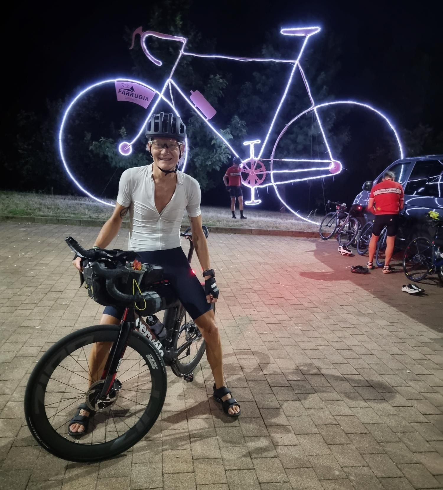
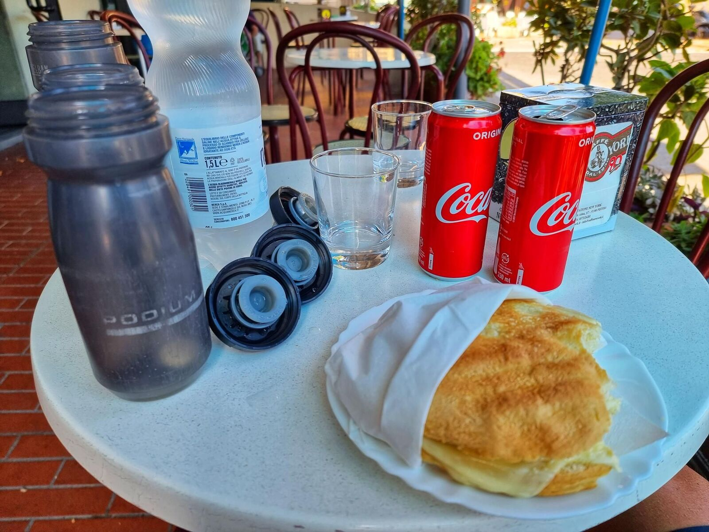
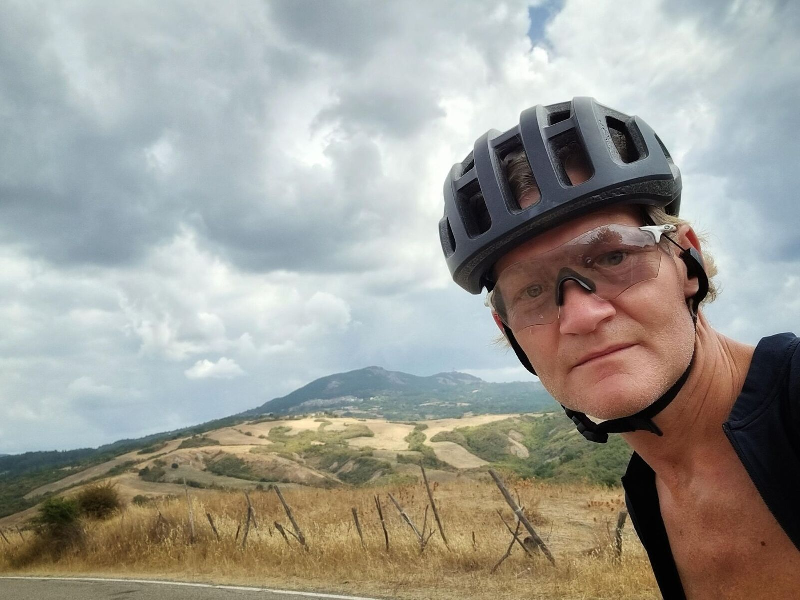
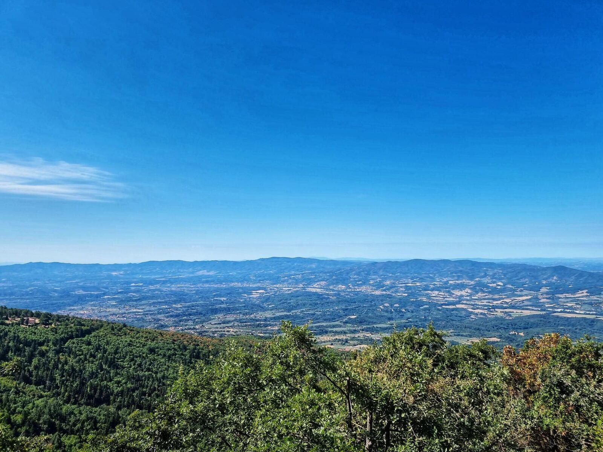
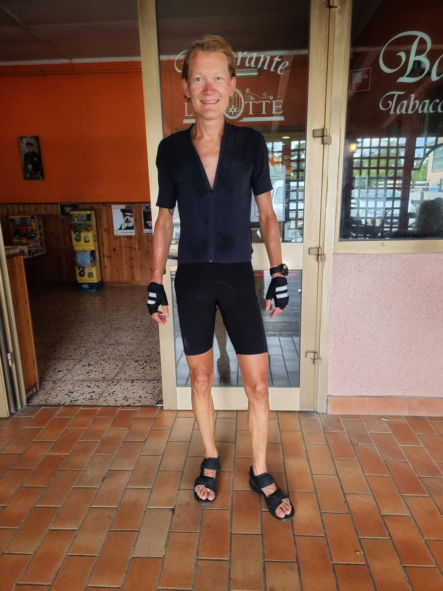

*Svensk version: [1001 Miglia 2021](sv/1001-miglia-2021)*

| | |
|---|---|
| **Race** | 1001 Miglia Green Reverse 2021, Italy |
| **Date** | 16–20 August 2021 |
| **Distance** | 1,610 km / 15,500 m |
| **Format** | Randonnée |
| **Bike** | Cervélo S3 |
| **Result** | 20th of 305 |
| **Total time** | 97:25 (moving 66:01) |
| **Overall avg** | 16.5 km/h |
| **Moving avg** | 24.4 km/h |
| **Rest %** | 32 % |
| **NP** | 148 W |

My fourth and final leg of L'Italia del Gran Tour, the others being 999 Miglia, Alpi 4000, and 6+6 Isole respectively.

RR to come...

[Strava 🔗](https://www.strava.com/activities/5835882151)
