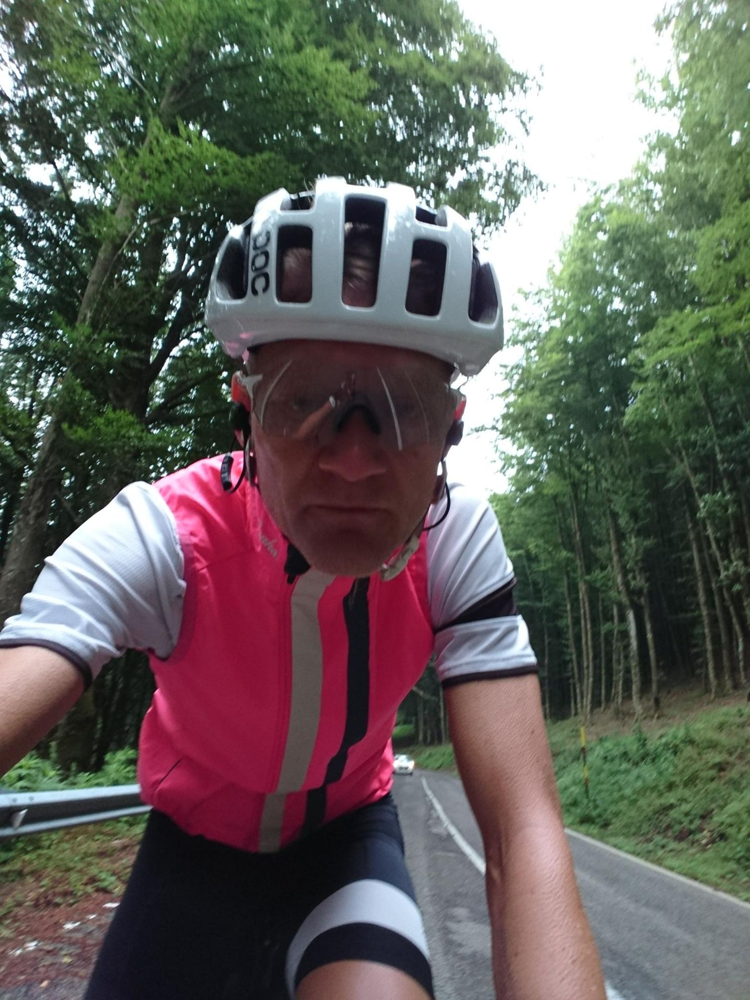
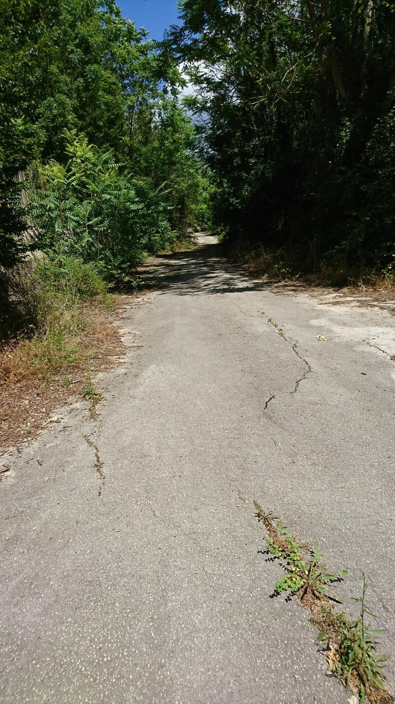
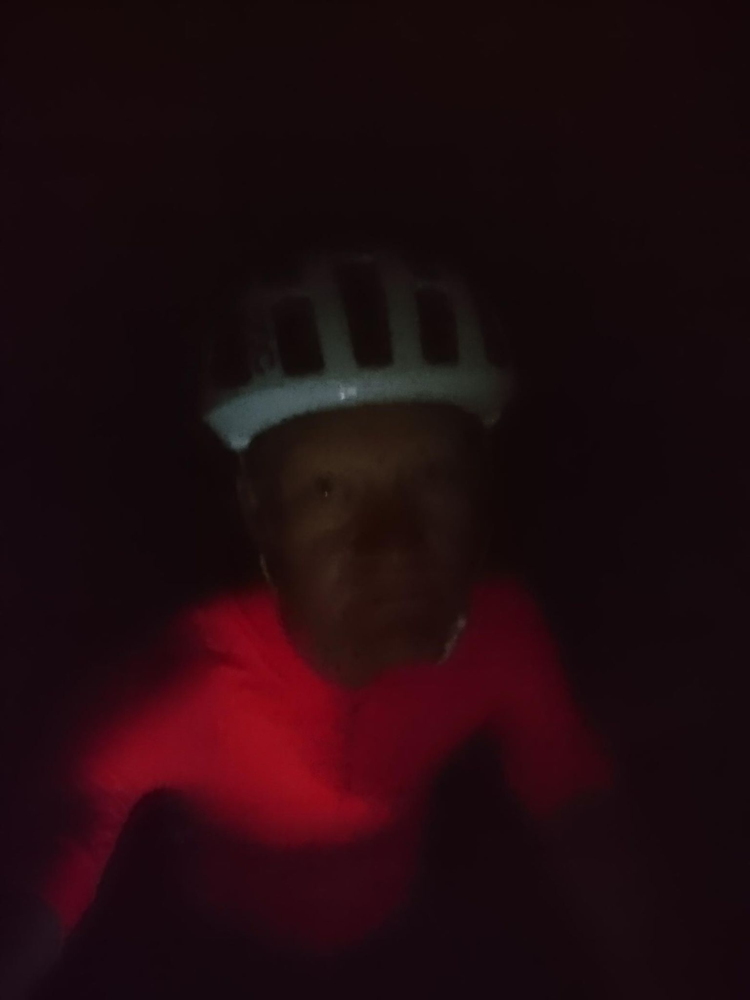
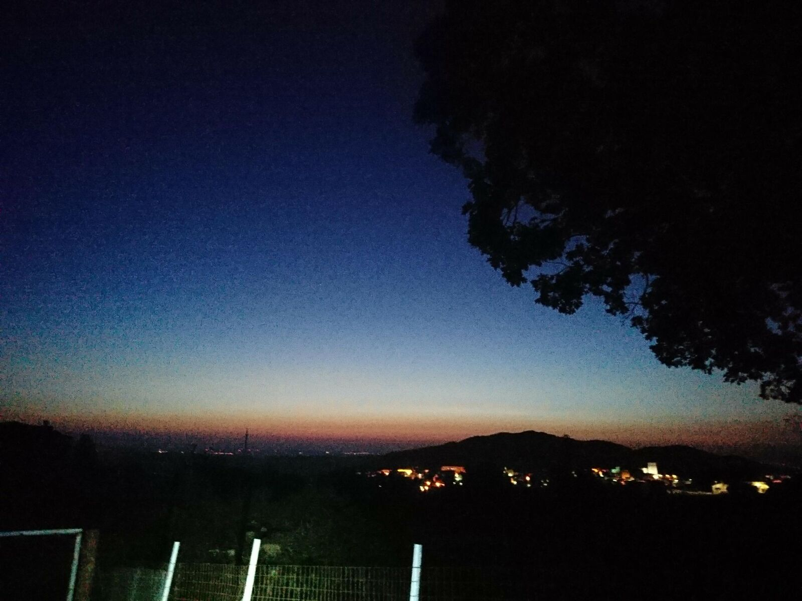
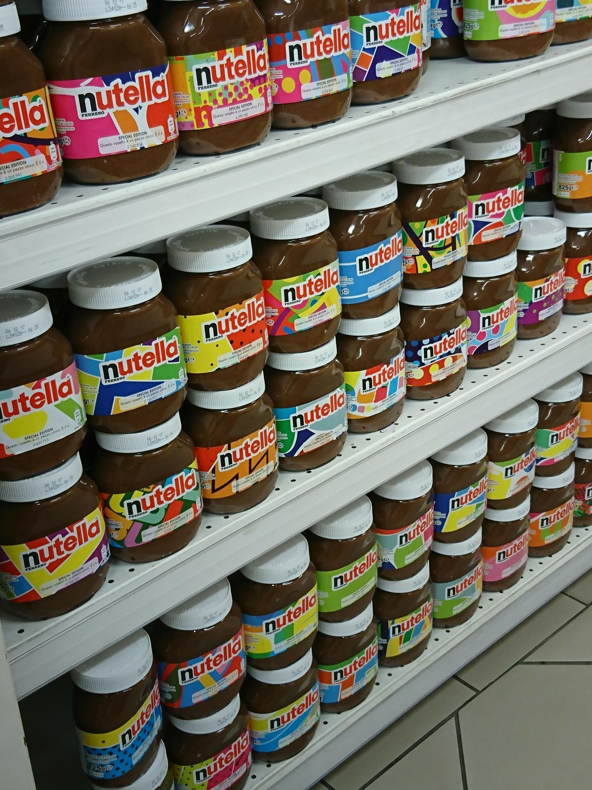

*Svensk version: [999 Miglia 2017](sv/999-miglia-2017)*

| | |
|---|---|
| **Race** | 999 Miglia 2017, Rome–Matera–Rome, Italy |
| **Date** | 25–30 June 2017 |
| **Distance** | 1,554 km / 21,588 m |
| **Format** | Randonnée |
| **Bike** | Rose X-Lite CWX |
| **Result** | 17th of 271 |
| **Total time** | 116:01 (moving 77:18) |
| **Overall avg** | 13.4 km/h |
| **Moving avg** | 20.1 km/h |
| **Rest %** | 33 % |

Managed to start with a broken body of the rear hub, which not only sounded awful, but also rendered many gears useless and made me constantly drop the chain due to a wiggling cassette. A visit to a bike mechanic the second day only cost me several precious hours, since there was nothing to do.

Rode solo about 85% of the time, just like planned. I was prepared to face aggressive dogs during the nights but it was awful and very frightening anyway, especially since I was alone all but one night.

Had also decided to go for a good finish time since my wife would arrive Thursday afternoon and celebrate our wedding anniversary in Rome. Hence I skipped sleep, which together with extreme heat and steep climbs made this just as much a mental journey as it was a physical one. Listening to Kent in 43 °C and severe headwind and sleep deprivation and starting to cry out of love and gratefulness was almost an out-of-body experience...

Due to a flat tyre 20 km from La Mirage, I missed the 116 h mark by a hair after the hardest 350 km of my life with lots, and lots, of climbing. (A few miles of the 999 missing because of involuntary Garmin pauses.)

[Risultati](https://drive.google.com/file/d/0B6krN2K5OxvjaEpuSkNjUWtYOVk)

[Strava 🔗](https://www.strava.com/activities/1065175120)
