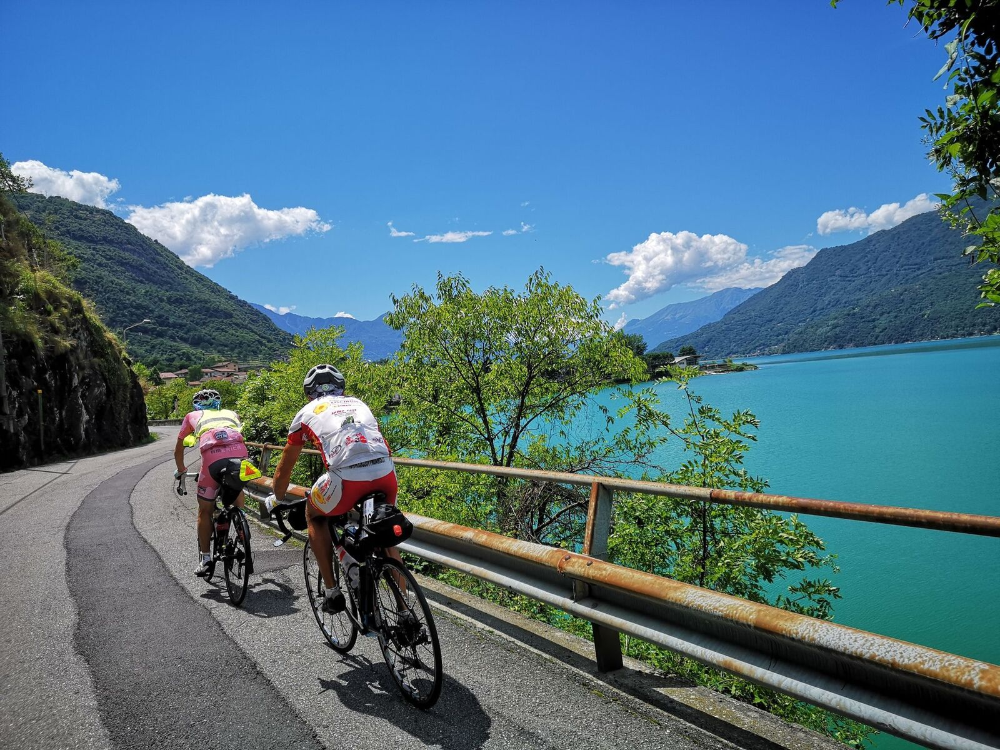
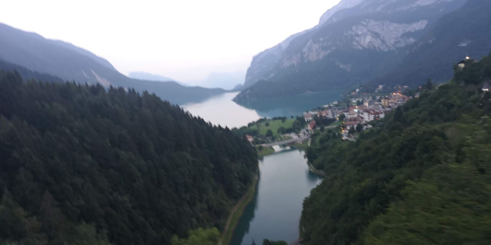
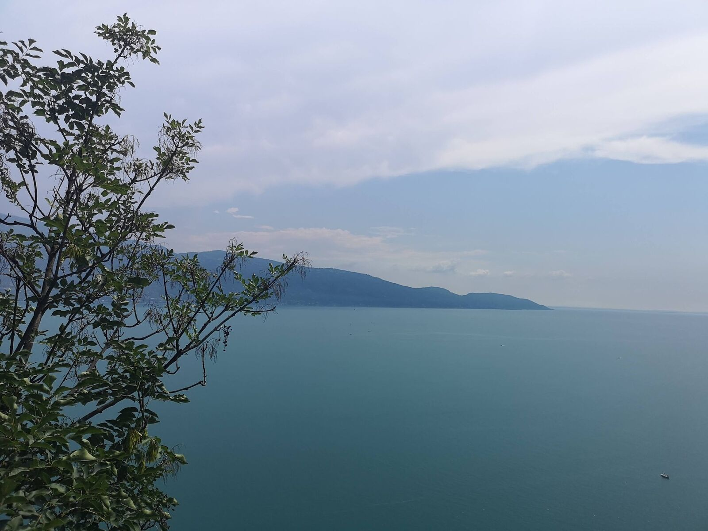
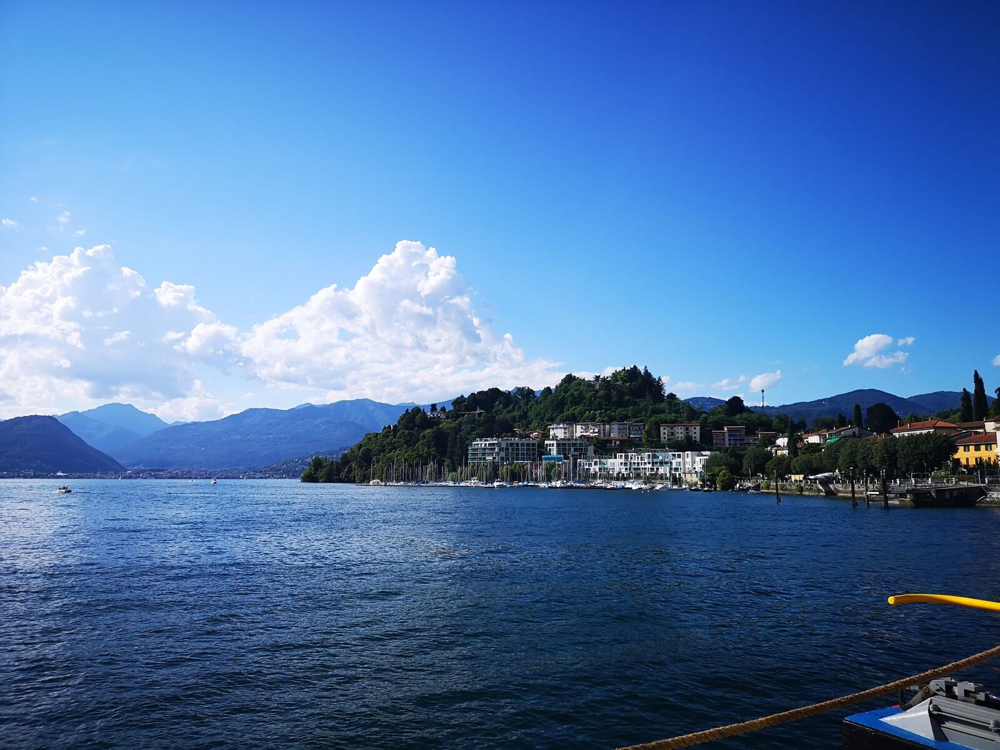
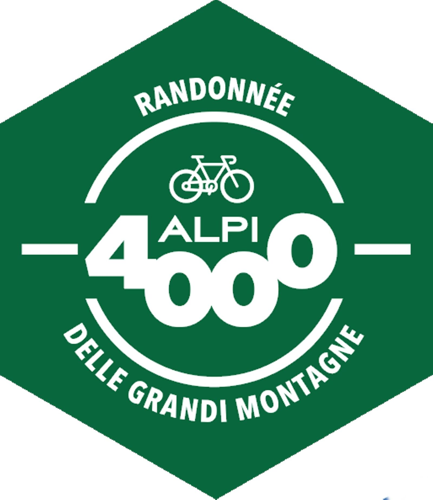

*Svensk version: [Alpi 4000 2018](sv/alpi4000-2018)*

| | |
|---|---|
| **Race** | Alpi 4000 2018, Italy |
| **Date** | 22–26 July 2018 |
| **Distance** | 1,519 km / 17,822 m |
| **Format** | Randonnée |
| **Result** | 16th of 400, official time 99:18 |
| **Total time** | 99:18 (moving 66:32) |
| **Overall avg** | 15.3 km/h |
| **Moving avg** | 22.8 km/h |
| **Rest %** | 33 % |
| **NP** | 136 W |

I knew it was going to be hard, but it was even harder with Stelvio as a diabolic final climb. Proud to have reached my sub100 goal as a solo rider. For the longest time I kept the tears at bay this time, but when Slowdive's Sugar for a Pill came on at the same time as I saw the 2 km mark on the Stelvio climb, I couldn't hold them back... Two down, two to go! #litaliadelgrandtour

Short interview seconds after I arrived at the final checkpoint: [Alpi 4000 on Facebook](https://www.facebook.com/alpi4000/videos/2152896978308167/)

[Strava 🔗](https://www.strava.com/activities/1736824096)
