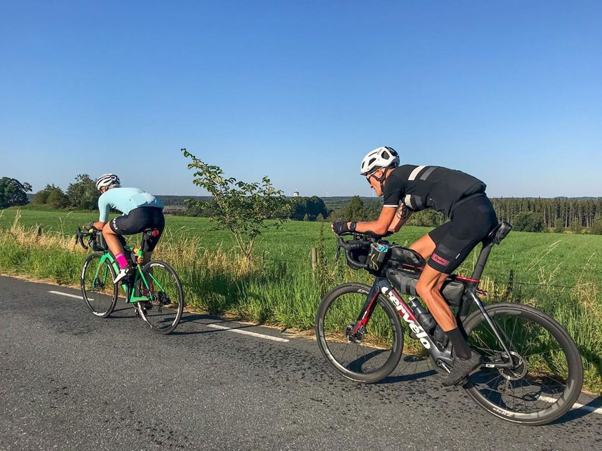
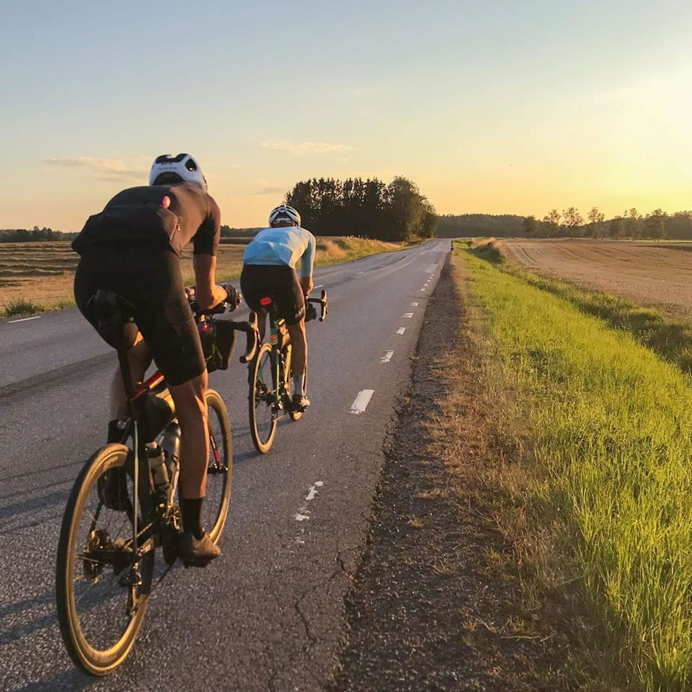
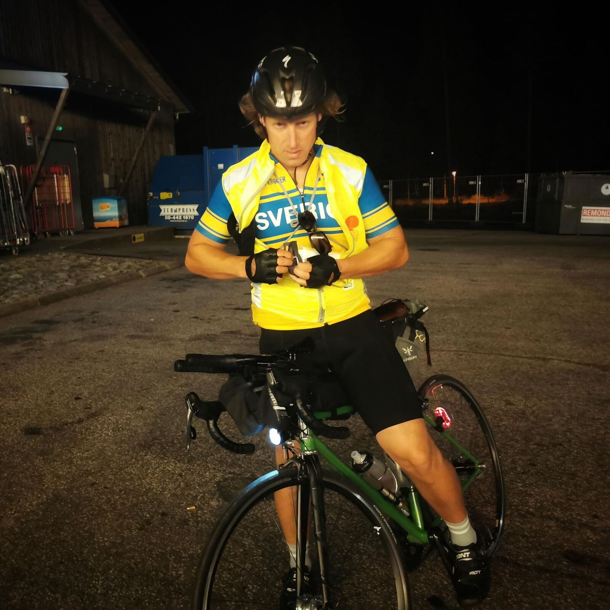
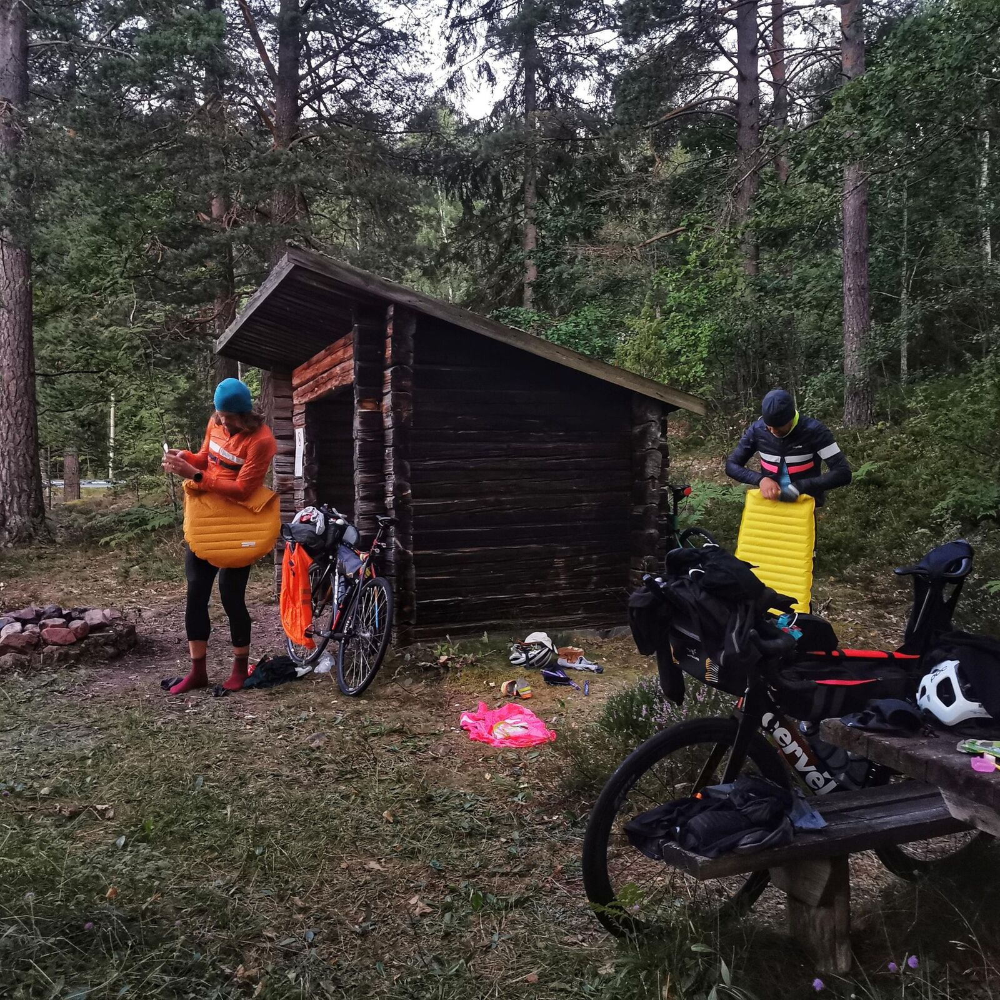
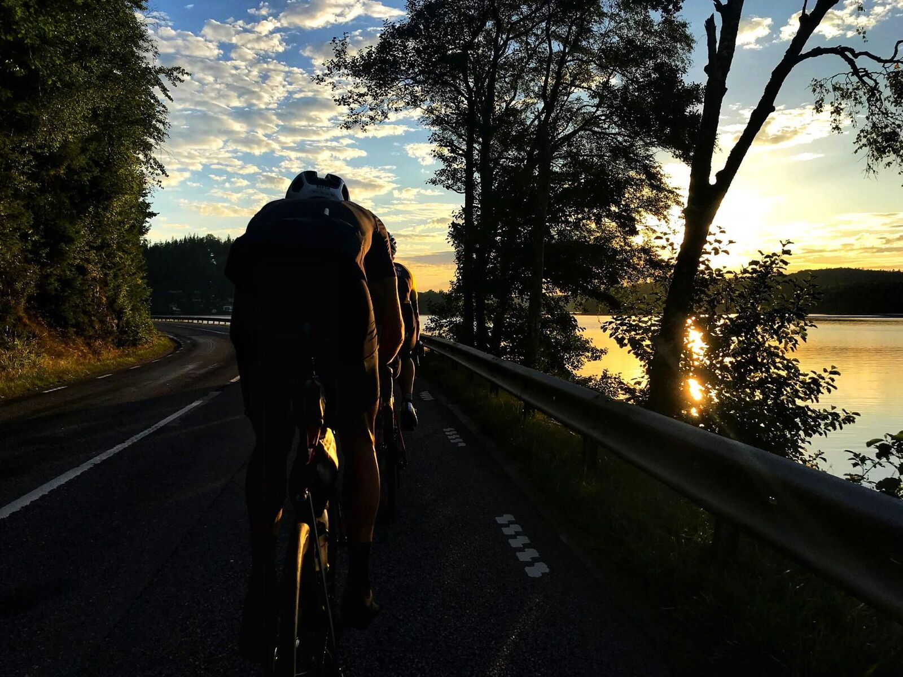

*Svensk version: [BRM 1200 Stockholm 2020](sv/brm-1200-2020)*

| | |
|---|---|
| **Race** | BRM 1200 Randonneur Stockholm 2020, Stockholm |
| **Date** | 13–15 August 2020 |
| **Distance** | 1,210 km / 9,342 m |
| **Format** | Brevet |
| **Bike** | Cervélo S3 |
| **Total time** | 50:39 (moving 42:27) |
| **Overall avg** | 23.9 km/h |
| **Moving avg** | 28.5 km/h |
| **Rest %** | 16 % |
| **NP** | 156 W |

Great ride in great company.

[Strava 🔗](https://www.strava.com/activities/3919524402)
