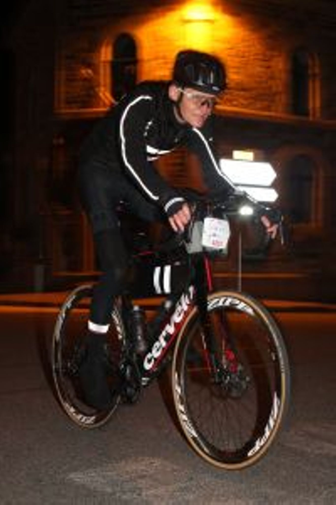
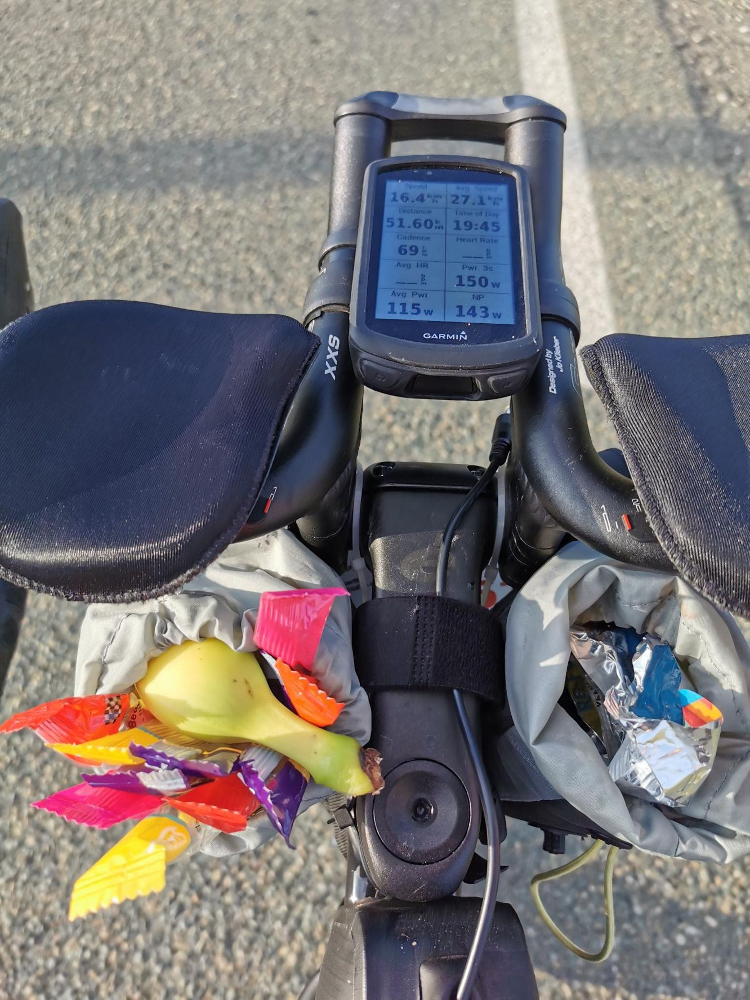
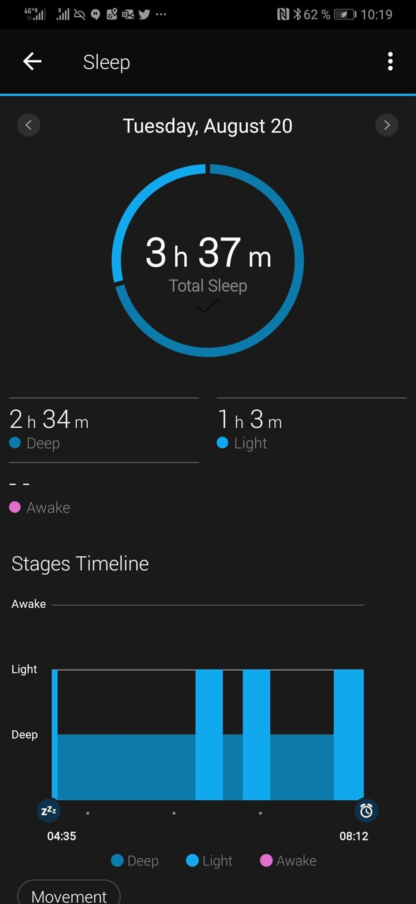
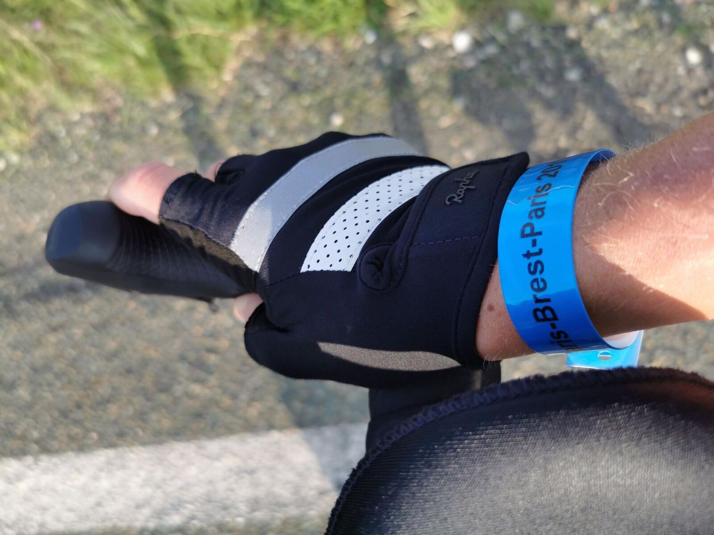
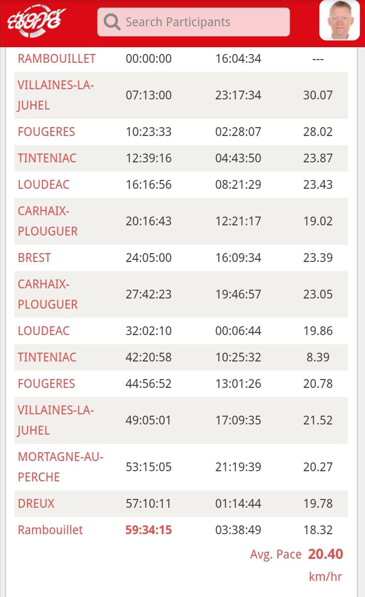

*Svensk version: [Paris–Brest–Paris 2019](sv/pbp-2019)*

| | |
|---|---|
| **Race** | Paris–Brest–Paris 2019, Rambouillet, France |
| **Date** | 18–21 August 2019 |
| **Distance** | 1,220 km / 13,206 m |
| **Format** | Brevet |
| **Bike** | Cervélo S3 |
| **Result** | 59:34:15 (was going for sub 50, got sub 60) |
| **Overall avg** | 20.5 km/h |

Was going for sub 50, but... lost the A-group and my mates John, Rimas, and Björn when I got a flat tyre after 5k. Took five minutes to fix, and tried to chase them (big mistake), but was eventually caught by the B group instead. Serendipity made me catch up with John (who had lost both the A group and our mates, so much for our game plan) in Fougères after some 200k. Since he knows everyone, we quickly formed a new team with Grant, Magnus, and maybe even Jonathan at this point (my recollection of the whole event isn't spot on...).

The first 200k I saw four crashes right in front of me, and I'm usually promoting randonneuring and ultra-cycling as safe sports :$ Never have I been so afraid during a brevet, and it doesn't help that many randonneurs seem to lack basic group riding skills. Sometimes with the help of others on the road, we pushed through the headwinds to Brest where the gusts on the bridge almost had Grant crash. The controls were worse time sinks than expected, so it took us 24h to get there.

I had gotten bad lower back pains early on, and the wattage required to make it to Rambouillet in 26h didn't help. On the contrary... :'( Popping pain-killers only helped for 20 minutes or so, why I chose to leave what was left of our group (John and Grant) in Quédillac and get supper, sleep (3h37m), and breakfast to see whether I could ride slowly to Brest or take the train from Rennes to Rambouillet.

Found a pharmacy in the morning, and took off to Tinténiac re-supplied. The lower back felt much better when not pushing hard, so I decided to give it a go at my bearable pace and not destroy it again by following suit when faster riders rode past me. The sleep had done me good after being awake for 44h, so I felt fresh and rested. Unfortunately, I had compensated with strange movements and low cadences, which took its toll on the right knee, so it was far from a painless ride, but the weather was nice :-)

At the final control in Dreux, I met my club-mate Fredrik who was going to leave with his friend Torbjörn, and we took off chatting at leisurely sub60 pace to the finish through yet another freezing cold night. 59h35m15s after the start, we rattled over the cobblestones of the bailey and had made it to the finish.

[Strava 🔗](https://www.strava.com/activities/2638730511)
