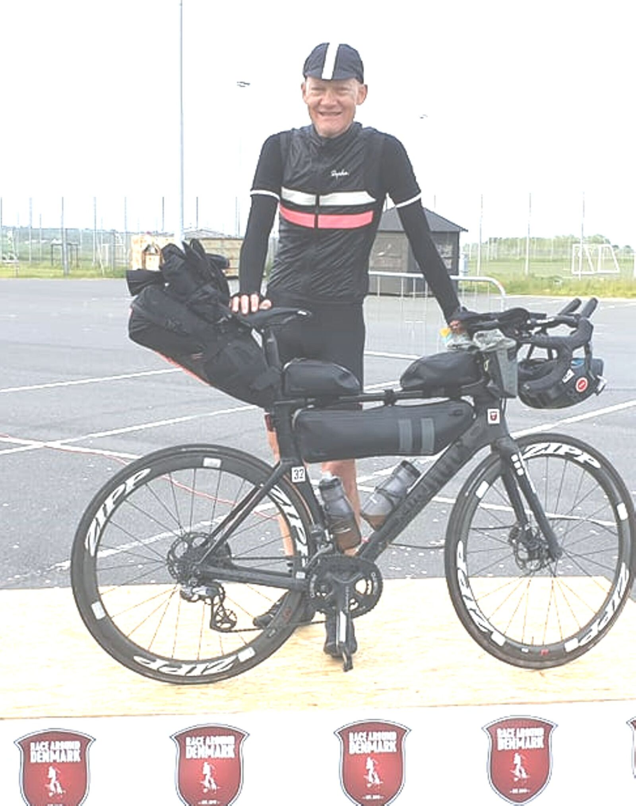
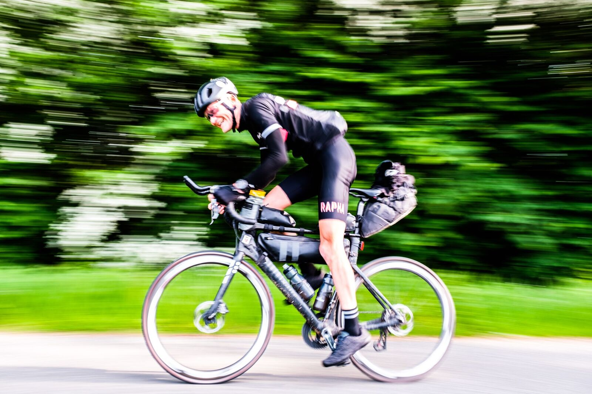
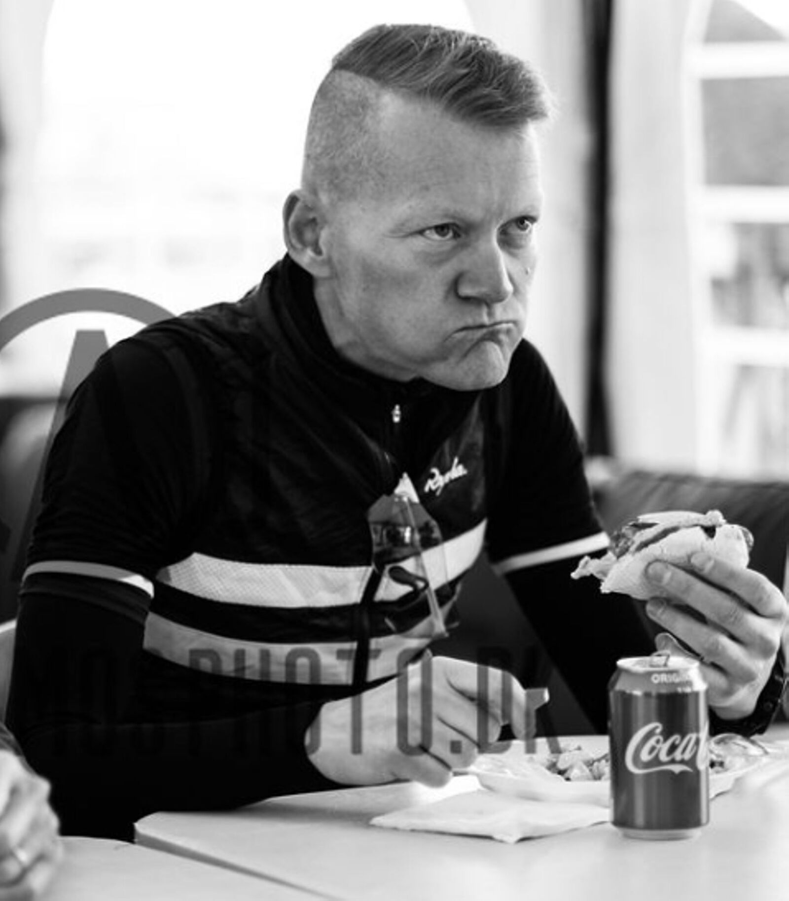
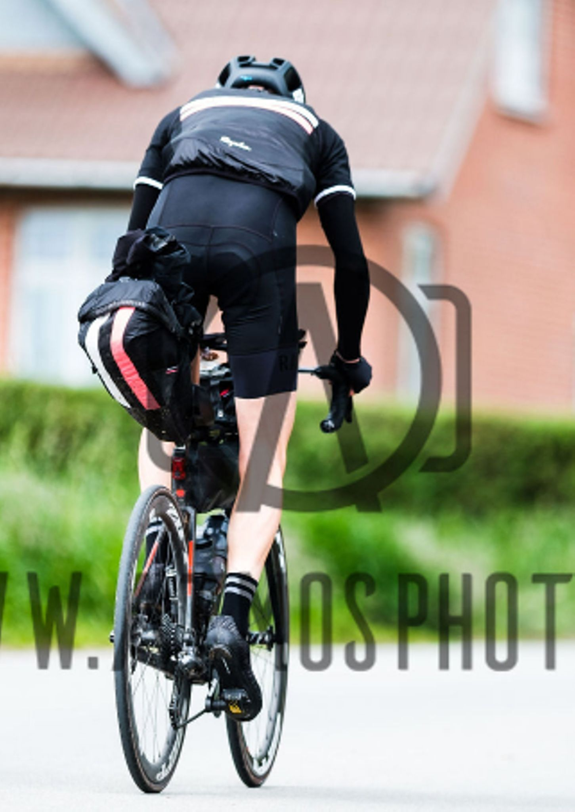
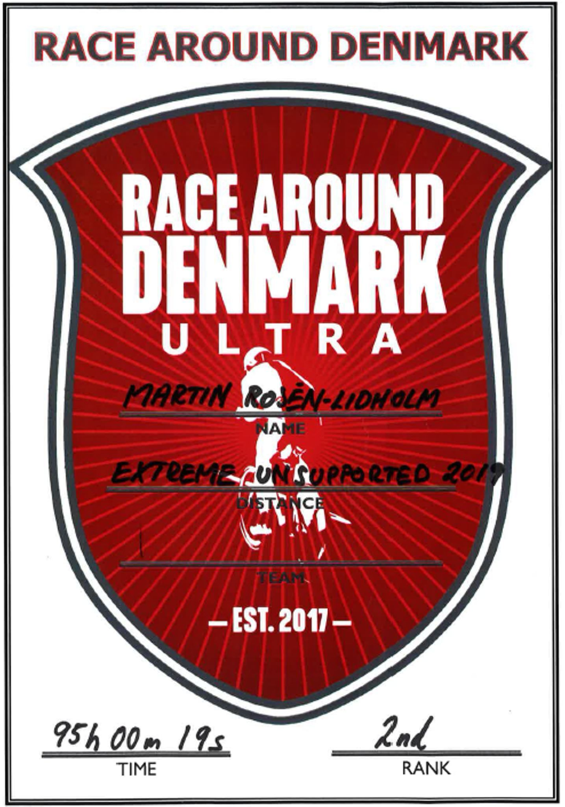

*Svensk version: [Race Around Denmark 2019](sv/race-around-denmark-2019)*

| | |
|---|---|
| **Race** | Race Around Denmark 2019, Horsens, Denmark |
| **Date** | 28 May–1 June 2019 |
| **Distance** | 1,584 km / 7,506 m |
| **Format** | Unsupported |
| **Bike** | Rose X-Lite CWX |
| **Result** | 2nd |
| **Total time** | 95:00 (official time 95:00:19) |
| **Overall avg** | 16.7 km/h |

Showed up ready to race with all the proper preparations I could imagine, although a tad intimidated by this year's extremely strong competition. And what a race it became, but as per usual with ultra-racing, not the way you have anticipated. The unknown unknowns are many and not far between in this sport! (Including e.g. an unmanned hotel that had forgotten about your reservation, which is the least you need at 4:40 a.m., as well as figuring out how to dismantle a crank road-side (twice!) with the panic of the risk of DNF'ing hanging over you while one of the combatants is passing with a cheerful hi!, and so on…)

This year saw horrible weather (freezing temps, long distances with strong headwind, and of course lots of Danish rain) and many DNFs. Quite early, a winner crystallised but we were a small bunch racing for the last two spots on the podium that ended in a sprint (which is 100 to 150 k by ultra measures BTW) that I won.

Set out for a place on the podium last year as well, but a lot of things went wrong, so it was extremely sweet to harvest the silver medal with a cheering family to greet you at the finish this gruelling year with such fierce competition.

I might be back for that first spot…

[Race Around Denmark on Facebook](https://www.facebook.com/racearounddenmark/posts/1045845648953974) · [The finish](https://www.facebook.com/racearounddenmark/posts/1046390022232870)

PS Had to change the date from 28th to 29th due to Strava fail and a very unhelpful support.

[Strava 🔗](https://www.strava.com/activities/2438568155)
