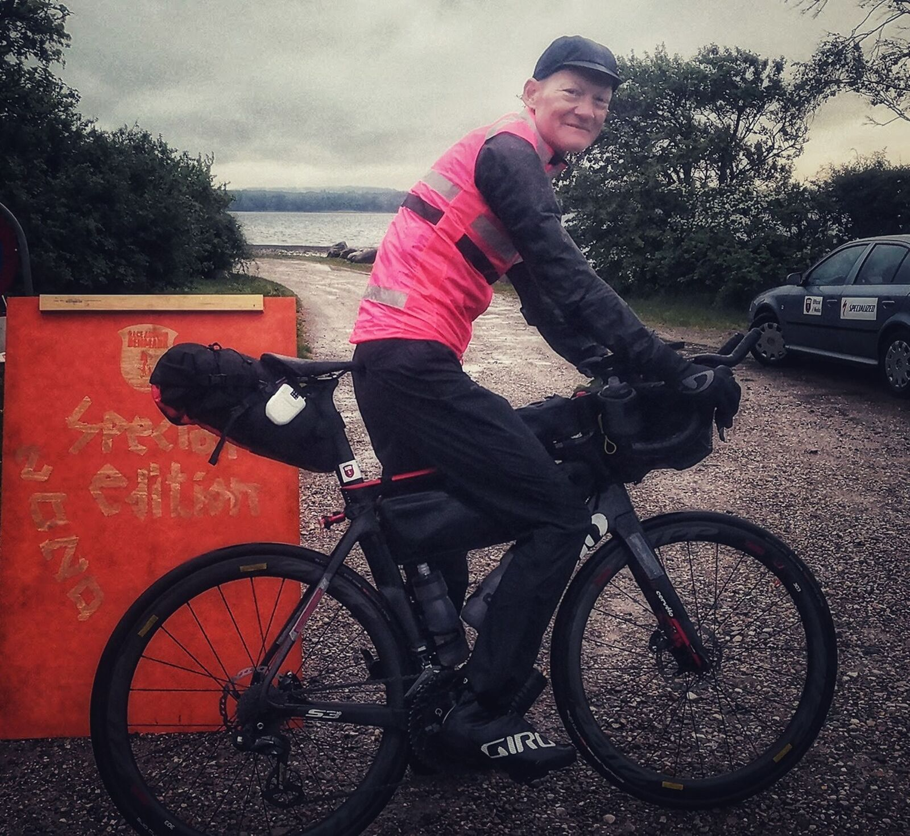
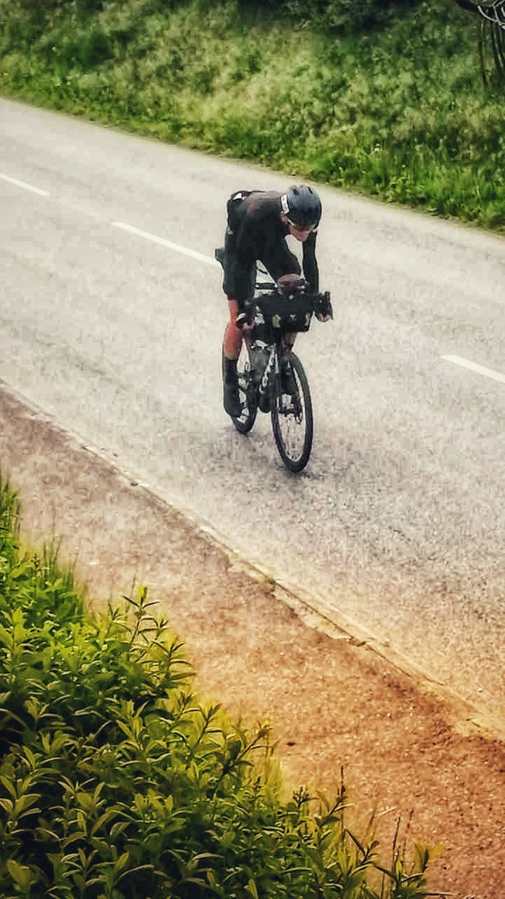
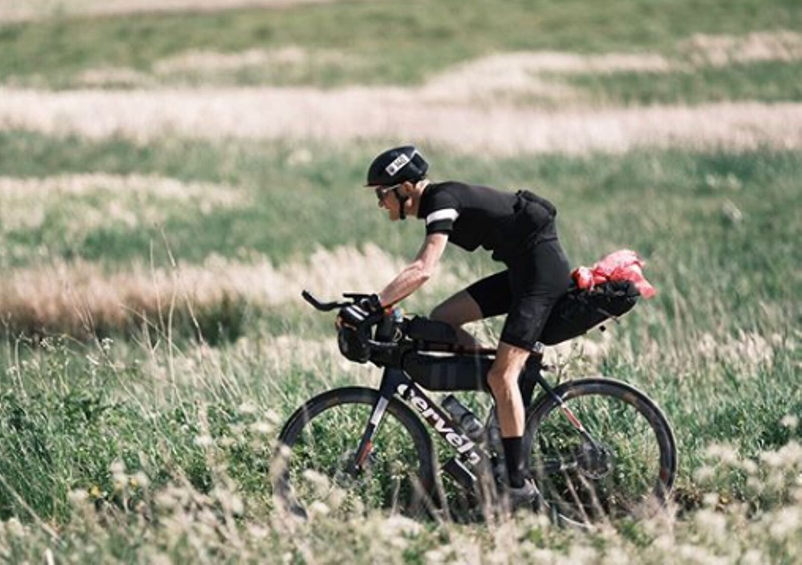
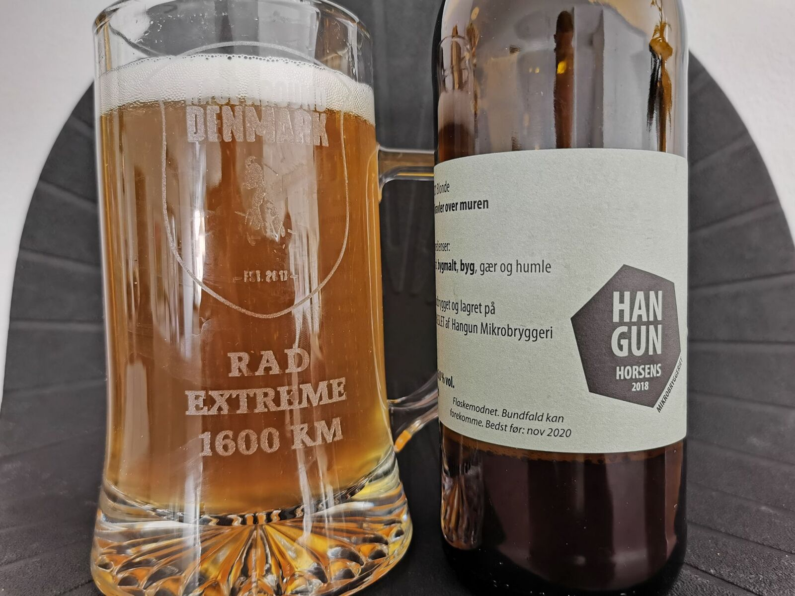

*Svensk version: [Race Around Denmark 2020](sv/race-around-denmark-2020)*

| | |
|---|---|
| **Race** | Race Around Denmark 2020 Special Edition, Horsens, Denmark |
| **Date** | 19–23 May 2020 |
| **Distance** | 1,567 km / 9,616 m |
| **Format** | Unsupported |
| **Bike** | Cervélo S3 |
| **Result** | 3rd of 18 |
| **Total time** | 90:07 (moving 61:08) |
| **Overall avg** | 17.4 km/h |
| **Moving avg** | 25.6 km/h |
| **Rest %** | 32 % |
| **NP** | 146 W |

Having raced around Denmark in the unsupported extreme category since its inaugural edition in 2018 and coming 🥈 in 2019, when the winning time once again was ~87 h, I set the bar extremely high at 81 h this year thinking it would yield that highest spot on the podium.

I managed to complete the race in under 81 h down to the minute in my spreadsheet despite a lot of unforeseen difficulties, where stomach problems were the biggest time thief and a torrential rain for hours on end like nothing I've experienced outside Southeast Asia being a good contender.

Despite crushing my PB and finishing hours before a previous winner, I missed that highest spot on the podium by ~2 h since the field of participants saw exceptionally strong riders this year, e.g. with the previous organiser and friend Peter Sandholt as a secret special guest starting last.

Here's a short interview at the finish: [Race Around Denmark on Facebook](https://www.facebook.com/racearounddenmark/videos/689896948426210/)

[Strava 🔗](https://www.strava.com/activities/3499196239)
