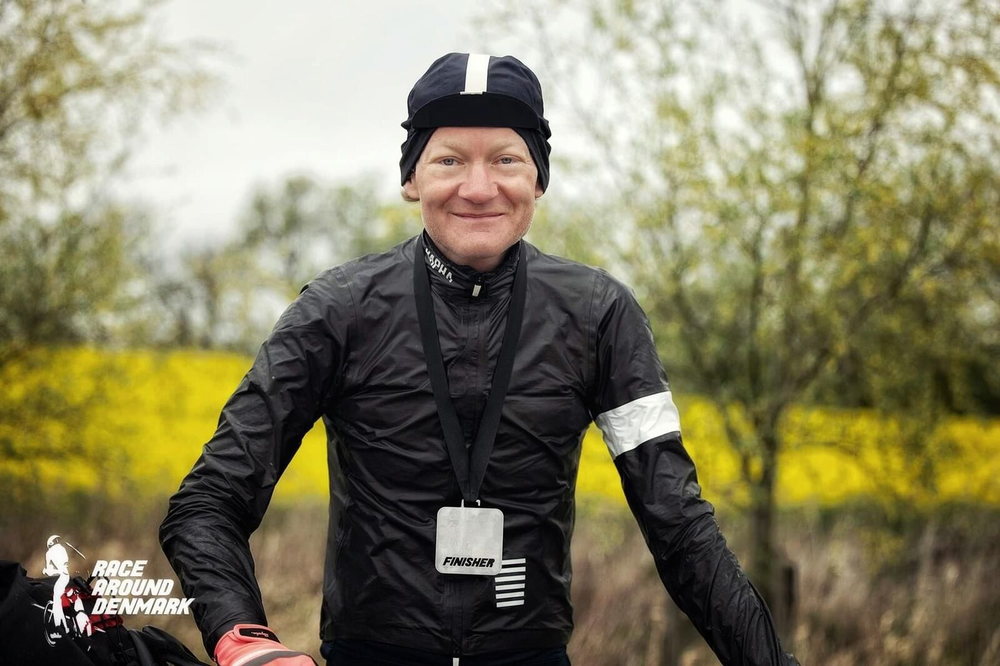
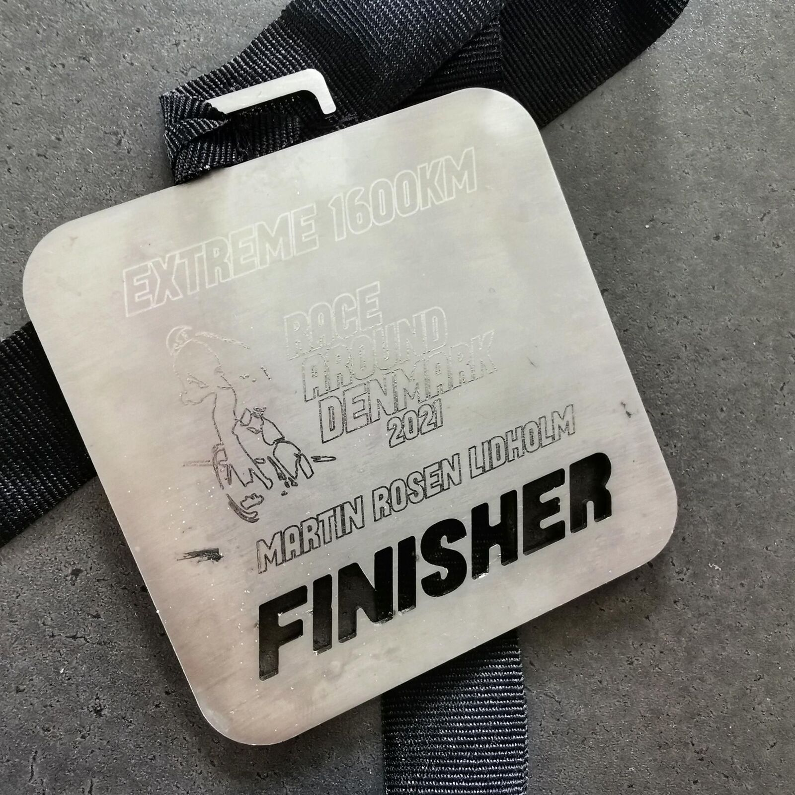

*Svensk version: [Race Around Denmark 2021](sv/race-around-denmark-2021)*

| | |
|---|---|
| **Race** | Race Around Denmark 2021, Kaløvig, Denmark |
| **Date** | 11–15 May 2021 |
| **Distance** | 1,610 km / 10,312 m |
| **Format** | Unsupported |
| **Bike** | Cervélo S3 |
| **Result** | [4th](https://racearounddenmark.org/resultater) |
| **Total time** | 89:47 (moving 65:54) |
| **Overall avg** | 17.9 km/h |
| **Moving avg** | 24.4 km/h |
| **Rest %** | 27 % |
| **NP** | 136 W |

## The plan

With last year's winning time ~78 h and an almost 50 km (i.e. ~2 h) longer, new route, I aimed at sub80 in hope of winning.

This aggressive plan was however based on the new concept of sleeping properly only once, halfway at the 800 k mark in Nyborg.

The training has been flawless, but I started with a bad stress stomach and the least amount of sleep ever, but I accepted the risks and stuck to the original plan. That. I. Should. Not. Have. Done…

## Jutland

Frequent WC visits are perishing time thieves and the body can't produce the estimated watts. Furthermore, the weather forecast couldn't be trusted, and the first 450 k Jutland offered plenty of rain (and so did both Funen and Zealand later in the race).

The Sandman made his unwelcome entrance with ~70 k left to Nyborg and the most backwoody parts of the route. In other words no playgrounds, churches or the likes where you can powernap. Sometimes it is impossible to ride the bike without going to sleep. Trying to powernap on stones and small electrical cabinets in the wet without any success. Ending up with micronaps hanging over the bars of the bike standing.

## Nyborg

After my worst hours within the sport ever, I'm finally at the hotel waving my required negative covid-19 test and trying my best to be polite to the very nice, curious, and chatty night porter. Luckily, I can do this kind of sleepover with all of its steps in my sleep by now, so I'm checked out rather quickly, only half an hour behind schedule compared to two at check-in. But the stress of missing my train has me forgetting to close my saddle bag, and I lose my puffy jacket, rain trousers, rain shoe covers, rain gloves, and the mitts.

## Second half

But. Powerless. With a good night's sleep, I'm supposed to make 150–200 rather fast ks. Decrepit and with the stomach worsening I watch the time passing a lot quicker than the miles and realise that a place on the podium is out of the question. Owing to learned circumstances, I choose to lodge at a church before the circadian rhythm relentlessly makes its recurrence in the 21 to 07 time span, since I've been riding for +34 h since the hotel visit.

## Fourth place

With a randonneur background, whose sport's goal is finishing rather than competing like ultracycling, I'm proud of having ridden the full route to a fourth place. But I came to race, not only finish, so I'm of course vexed over my failure. I'm however very happy for Elers', Bruno's, and Rado's sakes. Had a nice battle over the silver with Elers two years ago (in my favour), and have beaten Rado twice. Bruno was a new, very pleasant acquaintance. Aim to give a much better battle for the podium places next time boys!

## Time to Pretend

Ultracycling has many facets, and one I've come to appreciate rather than fear is how layer after layer of resistance peels off under physical and mental fatigue hour by hour without sleep. I usually cry over big, strong feelings, oftentimes from the love to and from my marvellous wife. This time however it was Time to Pretend by MGMT that got to me, since it's one of the firstborn's favourites and the vinyl has a place of honour in his room. An almost magical euphoria over being his father followed, and that alone made the tour worthwhile ❤

[Strava 🔗](https://www.strava.com/activities/5307807775)
