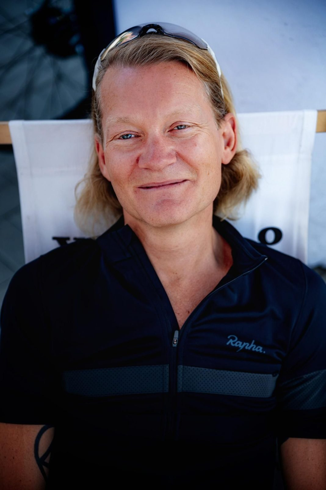
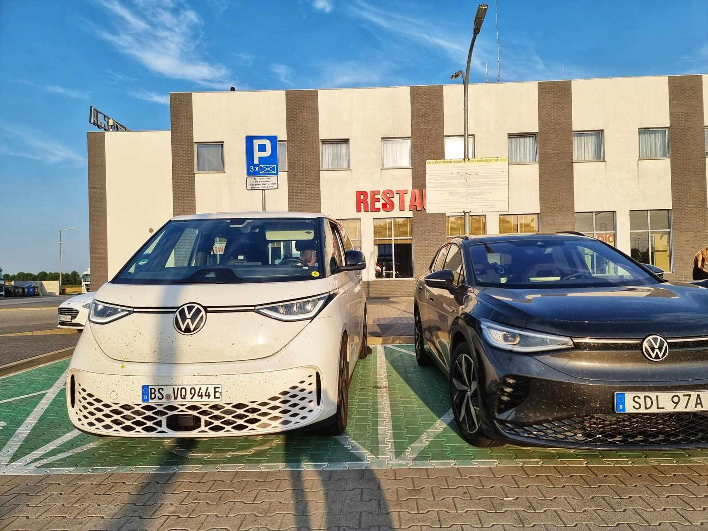
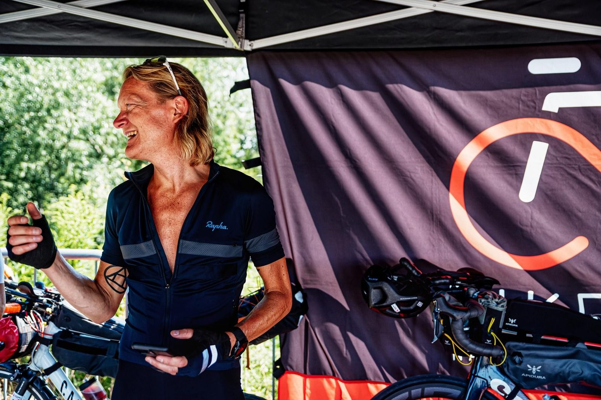
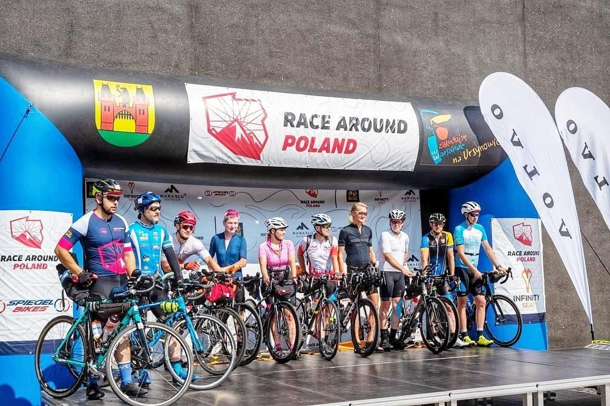
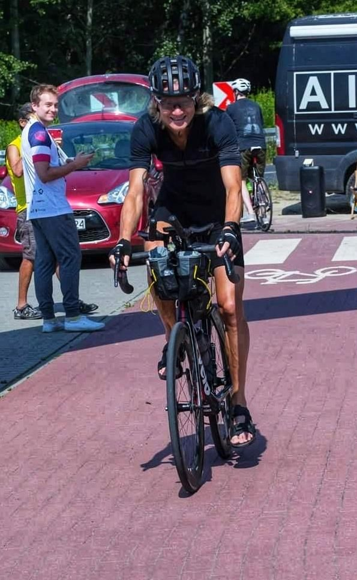
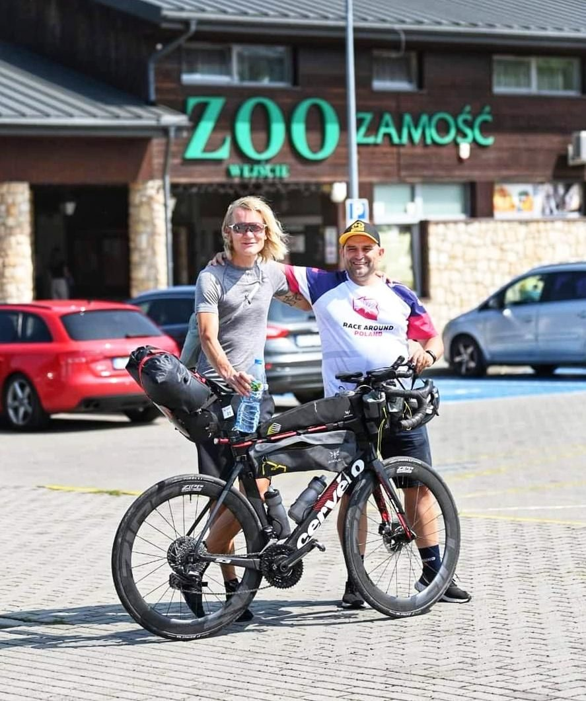
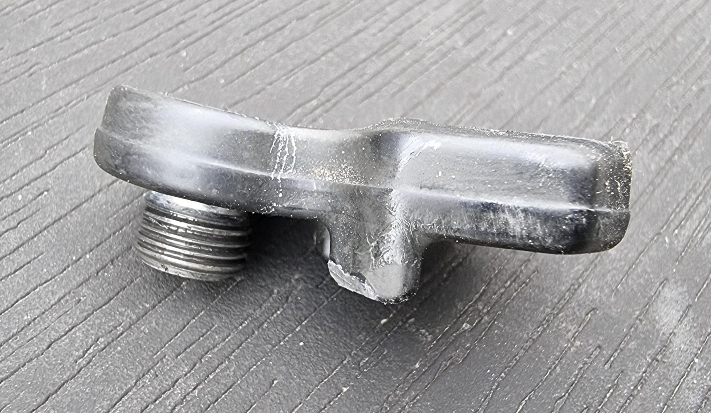

*Svensk version: [Race Around Poland 2022](sv/race-around-poland-2022)*

| | |
|---|---|
| **Race** | [Race Around Poland](https://racearoundpoland.pl/) 2022, Warsaw, Poland |
| **Date** | 23 July 2022 |
| **Distance** | 315 km / 1,084 m of 3,600 km / 33,000 m |
| **Format** | Unsupported |
| **Bike** | Cervélo S3 |
| **Result** | DNF, rear derailleur failure in the gravel section |
| **Total time** | 12:45 (moving 11:01) |
| **Overall avg** | 24.7 km/h |
| **Moving avg** | 28.6 km/h |
| **Rest %** | 14 % |
| **NP** | 143 W |

The proverb "little strokes fell great oaks" and the Swedish expression "it went the way it went, not the way it was supposed to" have buzzed and spun at the brain office ever since my life's first DNF was a fact.

## Getting there

Worked from the ferry from Trelleborg that made port in Świnoujście roughly 45 minutes delayed at 5:15 PM. The Polish EV charging infrastructure leaves much to be desired (the number of stations, the apps, etc.) so the midnight ETA became 3:14 AM stamped on the hotel's parking garage ticket. A night behind the wheel in true ultra-cycling spirit, in other words. Had of course confirmed EV charging in the garage but the single (!) outlet was of the wrong type. Lucky for me, since I was going to work from the hotel room, super slow charging from an ordinary outlet would suffice.

Race briefing Friday night with last year's supported winner Arvis, who this year became the first Latvian to finish RAAM and now would try to beat the world record for longest cycled distance in a week, as a bonus over video link. The impression from numerous questions to Remek over Messenger was confirmed; this is a super professional and equally warm and welcoming organisation. Car-borne, I had taken the rules of the CP boxes' max size H × W × L ≤ 100 cm literally and jokes were made about needing an additional trailer for my boxes alone ;-)

## Start

Poland and large parts of Europe had been boiling ever since the trip south and I showed up for bike inspection, sponsor tents, presentation of us racers (that struck a familiar chord from the TdF experience in Roskilde two weeks prior) Saturday morning. The sweat rolled down my spine in the heat on the stage, and the fresh air of the honorary ride together to the river by Obórki and the start and the Warsaw cyclists' Mecca was more than welcome. Got help learning to say thank you in Polish (crazy hard!) before the start and headed into the race at 11:06 AM.

As a Swede it can be uncommon with moist air, temperatures around 40 ℃ and tarmac that would be deemed a traffic hazard at home, but after having finished the first edition of L'Italia Del Gran Tour and its three 1,600 km randonnées during worse conditions, it felt familiar. Chose due to the heatwave to take down the power output a notch or two and drink a lot more than planned. Kind winds still gifted me with a rolling average of 28.5 kph.

## The breakdown

After ~310 km the gravel section we'd been warned about comes, and I take down the speed considerably. Although on 30 mm rubber, it's still race rubber and I don't want a puncture now in the dark with an incoming thunderstorm (and a sky lit up by lightning that means business). When the synchro shift shall shift the front rings at the snail pace, the chain gets stuck between the lower pulley wheel and the cage, hence pulling the whole thing into the rear wheel. Full stop, but manage to unclip and avoid falling over. Separate the firmly wedged parts but can no longer ride the bike. Thinking the hanger is the culprit and replace the part. Seems fine now, but a slow test ride once again throws the rear derailleur into the rear wheel. Thinking that the cage itself is bent and try to bend it without success. Scrapped an older Di2 rear mech due to the mech itself being bent and am thinking that must be it.

Been standing on the gravel for almost two hours now, and the downpours are yet to come, but have come to the realisation that the journey ends here for me. Then Philippe and his crew (supported, in other words) show up and offer me a ride to CP 1, which I accept after one second's thought. Call the most wonderful wife in the world from the van, get warm dumplings under a sail in the downpour at the CP at the gate of a park, talk to the arrived and arriving and after an hour or so am offered a lift by Berta and her husband, whose home this night serves as an ultra-cyclist hostel, get a shower, and crawl down into the kip, message Remek who's in charge of the broom car, and say hi to the Sandman.

## The rescue attempt

Talk to Remek, after having set the watch's alarm for 7 AM, who now is close. Berta, who might be the world's most helpful woman, possibly beaten by my mother-in-law, has during the night taken pictures of my rear mech, been in contact with the nearest bike mechanic 20 km away, had him talk to Remek who explained the predicament and thereafter chose to open the shop for us on a Sunday when everything is closed in the most religious part of the country. Get an offer from Remek to get a ride there, and in the event that the operation should succeed, be transported back to the place of the abortion. Answer yes without blinking. (Unusually relaxed unsupported rules for those of you who know these things; you're allowed outside help once during the race, for example.)

Unfortunately, the operation failed and both me and the mechanic focussed on the state of the hanger and failed to notice that the real culprit is the "axle unit" that on Shimano's Shadow-equipped gruppos conjoins the derailleur with the hanger (spare part Y3HR98010) and in the case of Cervélo obviously is more lenient than the latter. Buying a new one wasn't an option anyway since spare parts for these kinds of gruppos aren't stock items in the sticks of neither Poland, Sweden, nor other countries. Will never know, but it's highly unlikely that the unit could've been bent back to its operational self given the size and looks of the fracture.

## Epilogue

Have reserved my starting number (22) for next year's race and am out for revenge! How that went is in [Race Around Poland 2023](race-around-poland-2023).

The race: 3,600 kilometres and 33,000 metres of climbing.

Photos: [Damian Ługowski](https://www.instagram.com/damian_lugowski/)

[Strava 🔗](https://www.strava.com/activities/7541868790)
