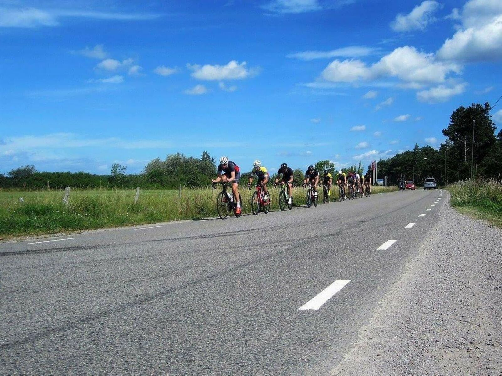
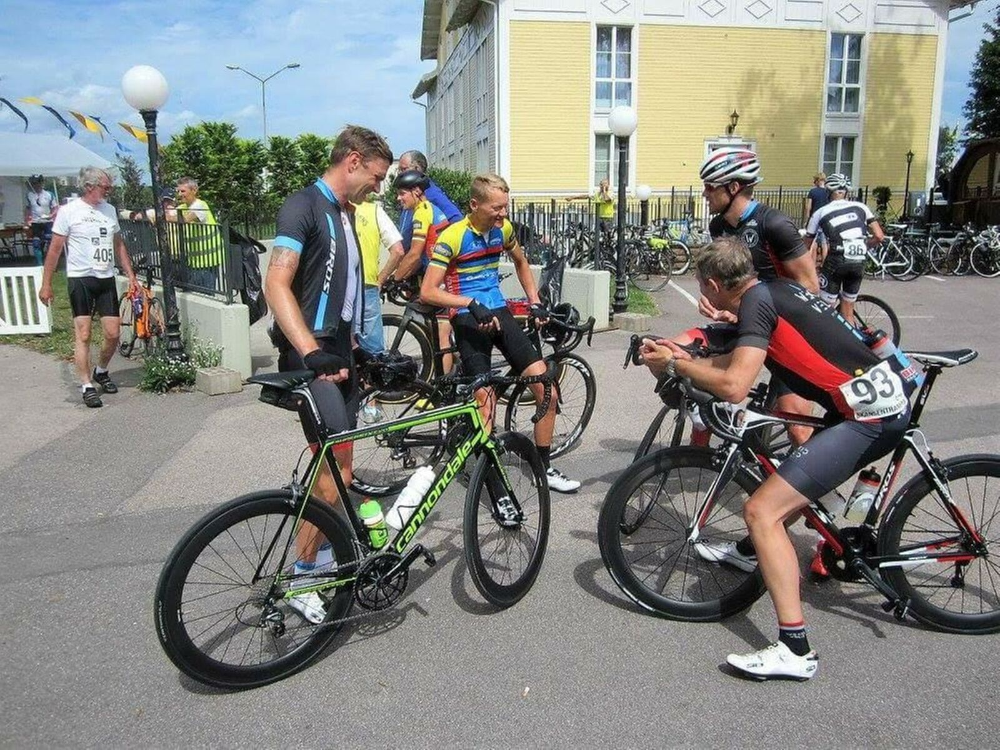
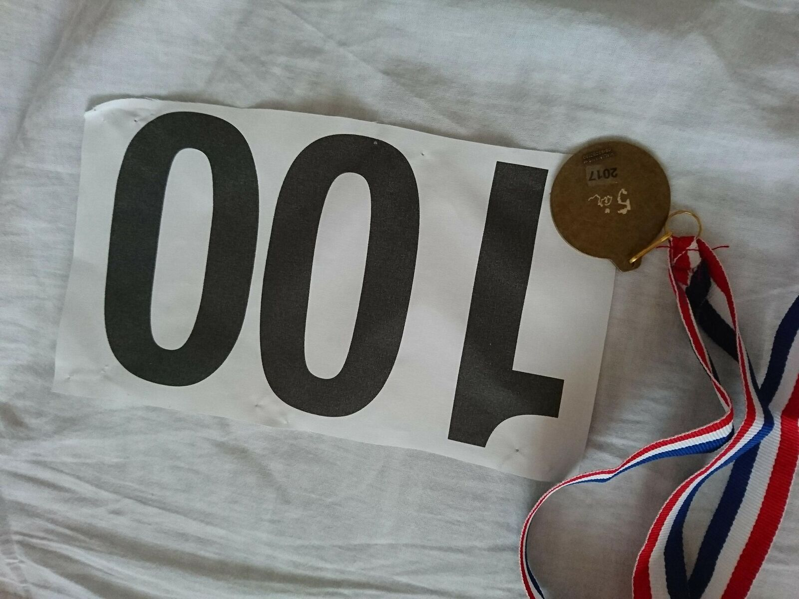

*Svensk version: [Skansentrampen 2017](sv/skansentrampen-2017)*

| | |
|---|---|
| **Race** | Skansentrampen 2017, Färjestaden, Sweden |
| **Date** | 29 July 2017 |
| **Distance** | 208 km / 367 m |
| **Format** | Sportive |
| **Bike** | Rose X-Lite CWX |
| **Result** | 5:12, in the group that beat the old course record |
| **Total time** | 5:12 |
| **Overall avg** | 40.1 km/h |
| **NP** | 191 W |

Not first across the line like in 2014, but gosh, what fun to beat the record in this 25th anniversary year. The old one stood at 5.21 and a handful of us came in at 5.12. However, "the machine" from TÖ pulled off a very stylish breakaway 25 km from the finish and set the new record of 5.04. A near superhuman effort in the prevailing winds. Chapeau!! Nothing to do but reload and go for sub5 in 2018 ;-)

[Strava 🔗](https://www.strava.com/activities/1106786921)
