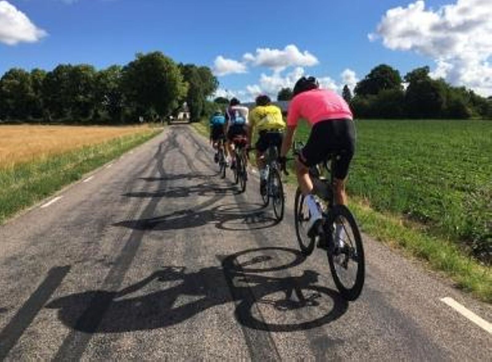
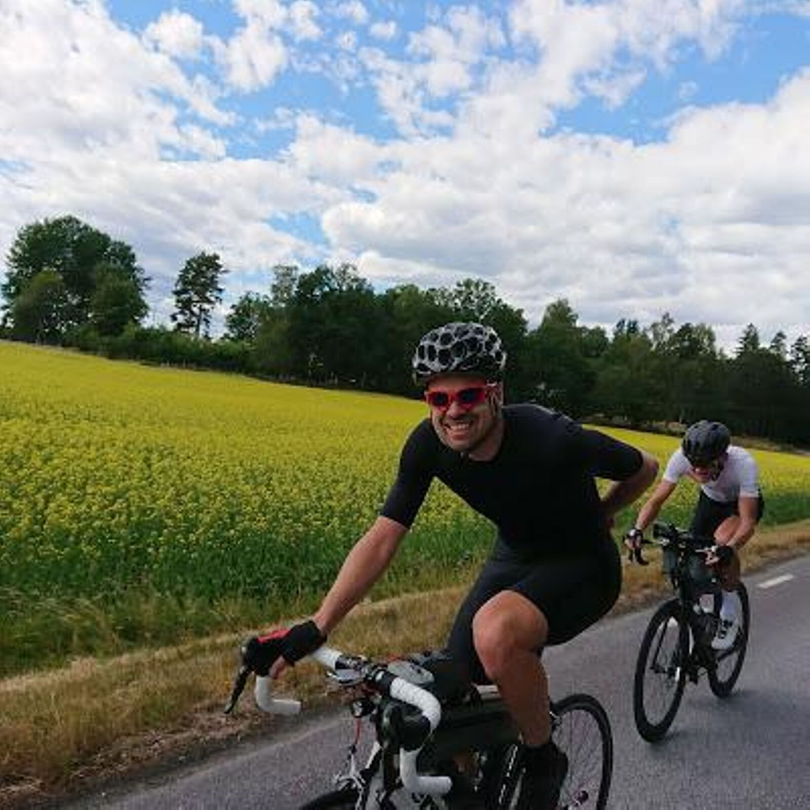

*English version: [BRM 600 Malmö 2018](../brevet-600-2018)*

| | |
|---|---|
| **Lopp** | BRM 600 Malmö 2018 |
| **Datum** | 30 juni–1 juli 2018 |
| **Distans** | 603 km / 3 739 hm |
| **Format** | Brevet |
| **Resultat** | 19:42, [svenskt randorekord på 60 mil](https://happyride.se/forum/threads/svenska-randorekord-uppdaterad-2025-11-08.3524375/) |
| **Total tid** | 19:42 (rulltid 18:40) |
| **Totalsnitt** | 30,6 km/h |
| **Rullsnitt** | 32,3 km/h |
| **Vilo-%** | 5 % |
| **NP** | 165 W |

Fyra polare. Ett mål. Krossade det!

Nils Calmsund, Oscar Hellström, Fredrik Millertson och undertecknad. Tiden står sig än i dag som [svenskt randonneurrekord på 60 mil](https://happyride.se/forum/threads/svenska-randorekord-uppdaterad-2025-11-08.3524375/).

[Strava 🔗](https://www.strava.com/activities/1672915097)
