*English version: [Race Around Denmark 2022](../race-around-denmark-2022)*

| | |
|---|---|
| **Lopp** | Race Around Denmark 2022, Kaløvig, Danmark |
| **Datum** | 24–28 maj 2022 |
| **Distans** | 1 609 km / 11 530 hm |
| **Format** | Unsupported |
| **Cykel** | Cervélo S3 |
| **Resultat** | [2:a](https://racearounddenmark.org/resultater) |
| **Total tid** | 87:09 (rulltid 66:25) |
| **Totalsnitt** | 18,5 km/h |
| **Rullsnitt** | 24,2 km/h |
| **Vilo-%** | 24 % |
| **NP** | 145 W |

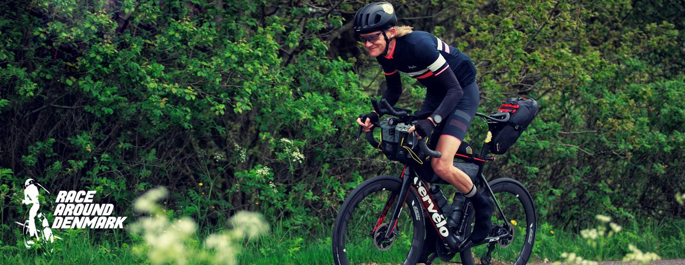

## Bakgrund

En något försenad RR från förra veckans RAD. Loppet har nu körts fem gånger i sin längsta samt icke-supporterad utgåva och likaledes min femte start. De första två åren med Peter Sandholt som race director och hans hemstad Horsens och stadens stora arena som start och mål. Mycket mysigt race-område med massor av grillad korv, godis, öl och läsk innan start kl. 20 med två minuters mellanrum. Inför tredje utgåvan hade Uggi Kaldan tagit över. Det hade även ett kinesiskt virus gjort, men hela världen så stackarn bodde i ett tält bredvid sin bil på en camping utanför stan och myndigheterna tvingade oss till halvtimmes utspridd start och jag fick tiden kl. 12. Fjärde utgåvan hade Uggi flyttat det hela ett par mil norr om sin hemstad Århus och supermysiga Kaløvig. Han hade även valt att göra om rutten en hel del och utan att ägna det en tanke göra den prick 160 mil lång, istället för Peters 155 (för att kompensera för tiden det tar med tåget fram och tillbaka över Storebælt). Starttid kl. 16 med två minuters mellanrum i fjor och liksom rutt oförändrat i år.

## Innan start

Startområdet ligger på genuina Gl. Løgtens (krog med fem lägenheter som kan hyras) område och med numer stora barn hade jag inte bara bokat in mig själv kvällen innan utan även min bättre hälft fredag till lördag plus ett lite lyxigare rum inne i stan lördag till söndag för att kunna göra stan (som verkligen levde p.g.a. Pride-festival) samt hänga i målområdet. Startdagen är alltid tisdag kristiflygarveckan.

Första fyra åren har jag bara satt mig i familjedieselbussen och styrt kosan mot Jylland, men i.o.m. byte till elbil fick det bli färjepremiär från "odden" och spara 20 mil enkel resa (lugnt och skönt måndag kväll efter jobbet ut, kaos och trångt söndag kväll hem). Ankommer planenligt vid niosnåret och får en fin kvällspromenad i solnedgången tillsammans med Per efter min ankomst och hinner även snacka lite med Uggi som dykt upp under vår promenad för att färdigställa start-/målområdet.

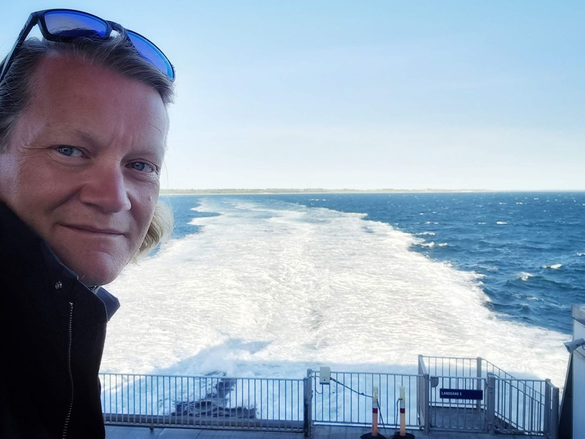

Egentligen ska dylika lopp laddas medelst vila, men jag har nyligen bytt jobb och just nu är det hektiskt med mycket som inte bara ska hinnas med men också många möten, så laddningen var allt annat än optimal med fullbokad tisdag innan start toppad med två timmar lång anställningsintervju. Man får ändå inse att det är jobbet som finansierar cyklingen och inte omvänt ;-)

Har nu genomfört ett otal liknande tävlingar och lopp och min akilleshäl är att magen har problem med denna typ av ansträngning kombinerat med det stora kaloriintag som är nödvändigt. Testade därför ett koncept med Fortimel ett dygn innan inspirerad av Strasser, men kunde inte säga nej till att tillsammans med Per, Anna och hennes gubbe käka frukost på Gl. Løgten då det även handlar mycket om det sociala. Mycket riktigt supertrevligt och jag satsade på jos och vitt bröd med marmelad för att vara så sjyst som möjligt mot matsmältningssystemet.

Per är en mycket kär och relativt ny bekantskap. Hade aldrig mött honom innan fjolårets Sverigetempot men vi körde hela loppet tillsammans till en delad andra bästa tid. 112 timmar under tuffa förhållanden sammansvetsar människor på ett vis jag inte kan erinra mig sedan lumpen och liknande umbäranden. Har haft glädjen att husera honom och köra skånsk fyrtiomilaklubbrevet tillsammans sedan dess vilket snart sker igen. Också otroligt kul att se klubbkamrat Fredrik på startlinjen i år i duokategorin tillsammans med Günter som jag äntligen fick träffa i levande livet under nämnda lopp genom Sverige. Marek har jag skrivit fram och tillbaka med sedan han visade intresse för RAD i fjor samt inte minst följt hans hårresande omänskliga träningsregim på Strava. Fantastiskt trevligt att äntligen träffas IRL och maken till vänlig och ödmjuk person får man leta otroligt länge efter.

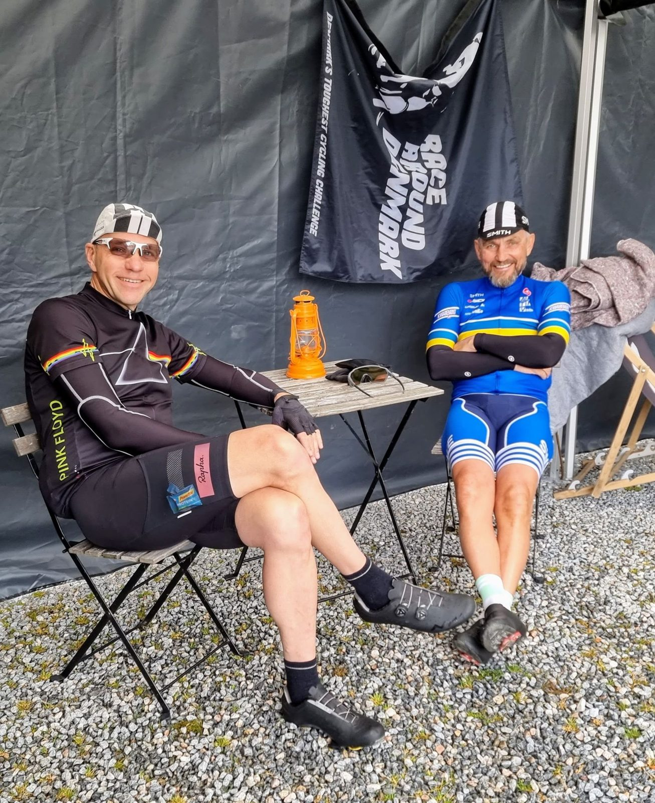

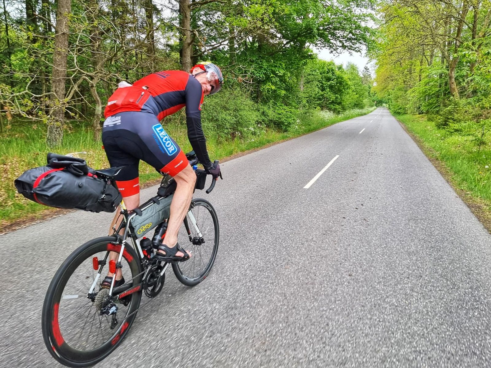

## Etapp 1: till Middelfart

Klockan blir äntligen 16 och vi släpps iväg pö om pö enligt tabellen i Race Book:en. Jag startar i mitten av fältet. Varje år lovar jag mig själv att inte gå ut så hårt i början vilket är lätt hänt när man är pigg och taggad, men vet att det kommer ske i.a.f. med så många kalvar på grönbete. Mycket riktigt kan jag inte låta bli att haka på det höga tempot och växlar många ord med särskilt Per och vi kommer efter 666 km ungefär samtidigt till ett hotell i Middelfart, dock utan att sammanstråla just där. Jag har min vana trogen några mil innan valt att köpa med mig en större nattamacka, två tebirkes, smoothie och chokladmjölk som kvällsmat och frukost. Vädret har varit ganska styggt med ett tufft skyfall så jag plockar för säkerhets skull ut det mesta från väskorna för torkning innan dusch och sänggående. Satsar på 4 t 15 min sömn men det blir blott 3 t 43 min och jag har duktigt ont i mina knän när jag kissar efter ~2 t. Det har bara hänt mig under tuffa förhållanden i italienska berg under lika långa lopp och med mekaniska problem som tagit bort de lätta växlarna. Mycket oroande och tyvärr smärtor som håller i sig hela loppet och i skrivande stund kan jag inte ens cykla till jobbet utan att det gör ont i höger knä, medan vänster verkar ha läkt. Har en misstanke om att det var nya skor, pedaler och klotsar som ställde till det då det var mycket tufft att klicka ur när regn och skit gjort sitt.

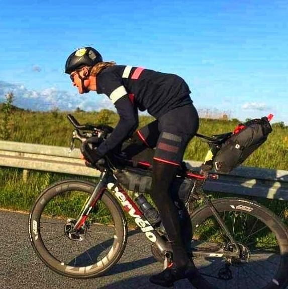

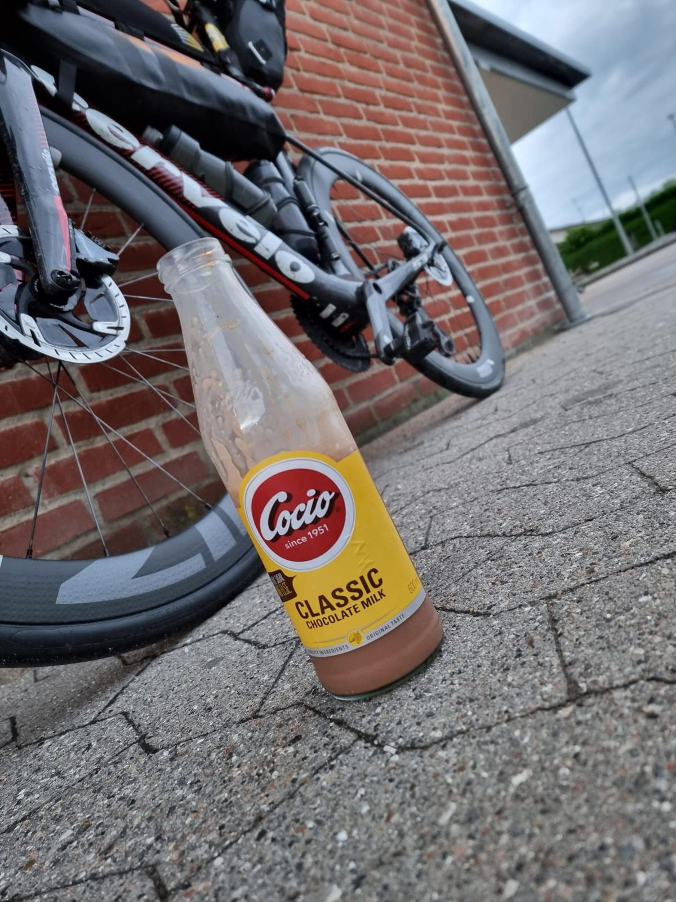

## Etapp 2: Själland

Kommer iväg vid tvåhugget på natten och då är både Marek och Per långt före då de valt att antingen inte sova eller sova betydligt färre timmar. Det är dock viktigt att känna sina begränsningar och köra sitt eget ultralopp vilket är en mycket stor skillnad mot ett linjelopp där det tvärtom handlar om hela tiden läsa fältet och förhålla sig till taktiska överväganden. Vind och temp. är gynnsamma, men tyvärr vått. Antingen från ovan men som regel från vägbanan, eller regn underifrån som jag kallar det. Planen är att nå ett hotell på Själland 542 km bort på 24 t. Fortimel-dieten har fungerat överraskande bra, men nu tar belastningen ut sin rätt på magen. Dessutom slutar min tracker att fungera som ger många samtal och chattande med inte minst Uggi. Tidsödande och det sista man vill lägga sina vid detta laget begränsade kognitiva förmågor på. Oklart hur eller varför, men efter jag-vet-inte-hur-många omstarter av trackern (som är lite mer involverade än ett enkelt knapptryck) vaknar den till liv igen efter några timmar och bilen som är på väg med en ny kan vända åter till Jylland.

Är riktigt seg och söker sällskap hos Formiddag med Simpson för musiktugg och härlig musik på P6 Beat. Då får jag plötsligt massor av pepp och ❤ av först Lars Fly som bjussar på en Cola, sedan dyker RAD 2020s stora hjältinna Elin Starup upp med gubbe, därefter randopolarn Rasmus Krog och inte minst Steen Linder-Madsen som inte bara kommer ut i bilen men även senare hälsar på medelst velociped i mörkret och jag lär mig det mesta om det danska efterskolesystemet bl.a. Jag har stor respekt för resten av resan mot hotellet på norra Själland då jag inte längre kan räkna gångerna John Blund kommit med sin melatonindos och man somnar bakom styret. Självklart öppnar sig himmeln ånyo och det är bokstavligt talat som att cykla i en dusch med bra Felix-stör-en-ingenjör-tryck. Räddas av en trevlig gammal träbusskur och får en fem, tio minuter lång kraftlur och klockan hinner bli halv fyra på morgonen när jag trött, blöt och kall sladdar in på hotellet och trycker ner två energistycksaker samt en Fortimel, duschar och kommer i säng. Nu är jag långt ifrån både drömtid och toppstrid samt vet att nästa dag ska bjuda på 17 m/s motvind till Jylland via Fyn, så jag fattar det kloka beslutet att ånyo sätta klockan på 4 t 15 min sömn (vilket likaledes ånyo blir något mindre, 3 t 31 min) väl medveten om att min ursprungsplan gått om stöpet och att Hr. Blund obönhörligt kommer surfandes på den cirkadiska rytmens våg även kommande natt.

## Etapp 3: hem över Fyn

Då jag är efter plan ges möjlighet till hotellfrukost och jag satsar på att göra flugorna kaloriintag och få ordning på magen på smällen vilket lyckas. Prognosen ser lovande ut och jag kommer iväg kvart över nio med på tok för lite kläder. Varför lär man sig aldrig vindavkylningseffekten? Nyborg station har en stor välsorterad 7-Eleven och liksom på väg åt andra hållet provianterar jag här, passar på att äta, besöka toan och fylla på vatten och är så redo man kan vara för det hårda benet över den lilla ön. På Fyn fryser jag som en hund i den hårda motvinden trots upp mot 20 °C på Garmin-skärmen. Knäna blir allt värre, särskilt högra, så det är svårt att mata ut effekt vilket obönhörligen straffar sig med långsam cykling.

Äntligen över Lillebælt och tillbaka på jysk mark! Nu ska blott de dryga sista 30 kuperade milen besegras för att vara i mål i Kaløvig! Naturligtvis gigantiskt skyfall under de tidiga mörka timmarna och detta är även loppets kallaste timmar en bra bit under 10 °C. Precis som jag räknat med blir det till slut omöjligt att hålla sig vaken bakom styret. Här är mitt hemmagjorda cue-ark en stor hjälp då jag vet att det 67 km in på sista benet kommer en kyrka med öppen toa. Den är dock superliten men har både fisljummet element och en dörrmatta, så jag kryper upp i hörnet insvept i min värmefoliefilt (som jag alltid har med i händelse av olycka). Min klocka förmår inte regga denna sömn, men jag tror att jag blir sittandes ungefär en timme.

## Mål

Vaknar fräsch som en nyponros ;-) och det är bara att trampa till Kaløvig och bärga silvret lugnt och fint (då Per ledsamt nog brutit) med de ömma knäna då det inte finns vare sig någon att jaga eller någon i bakhasorna. Magiskt att se min fantastiska hustru i mål arla morgonstund tillsammans med Uggi och efter lite gutt tugg med dem, dusch och likaledes magisk frulle på Gl. Løgten toppad med utvilade segraren Mareks entré och ett längre snack med honom vilket förmodligen fungerade som välbehövlig debriefing även för honom. Därefter två timmars sömn, dricka öl med Meagan och Per, ta emot Fredrik och Günter och vidare in till Århus för massor av mat, vin och "hygge" :D

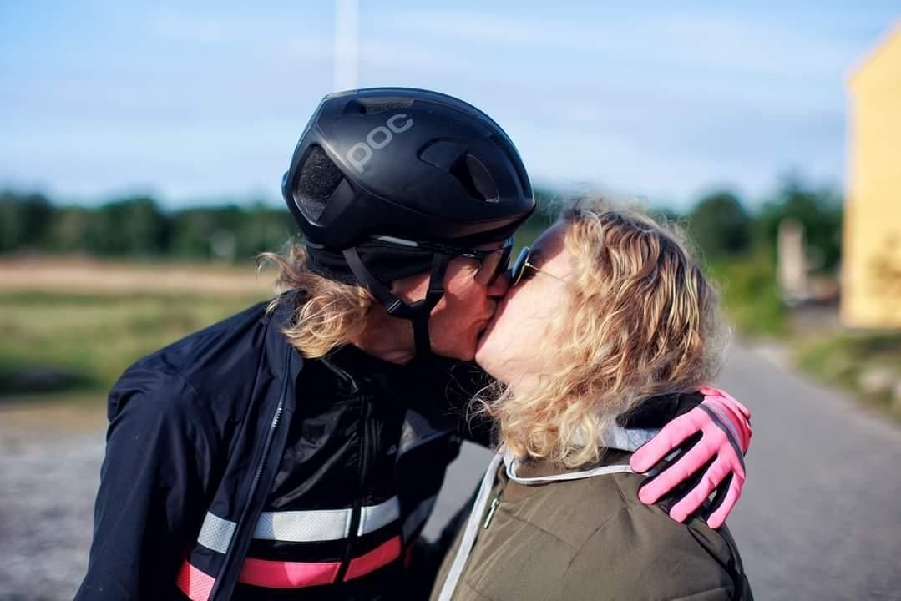

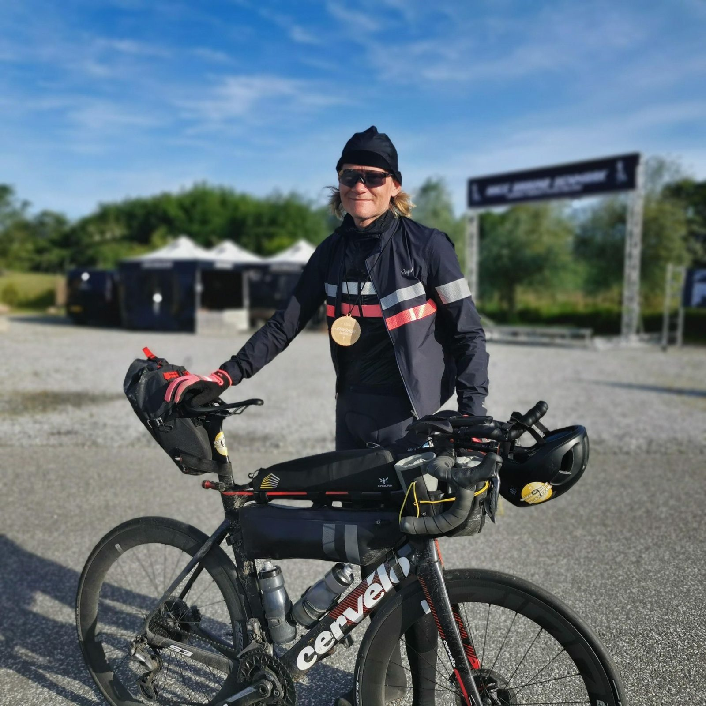

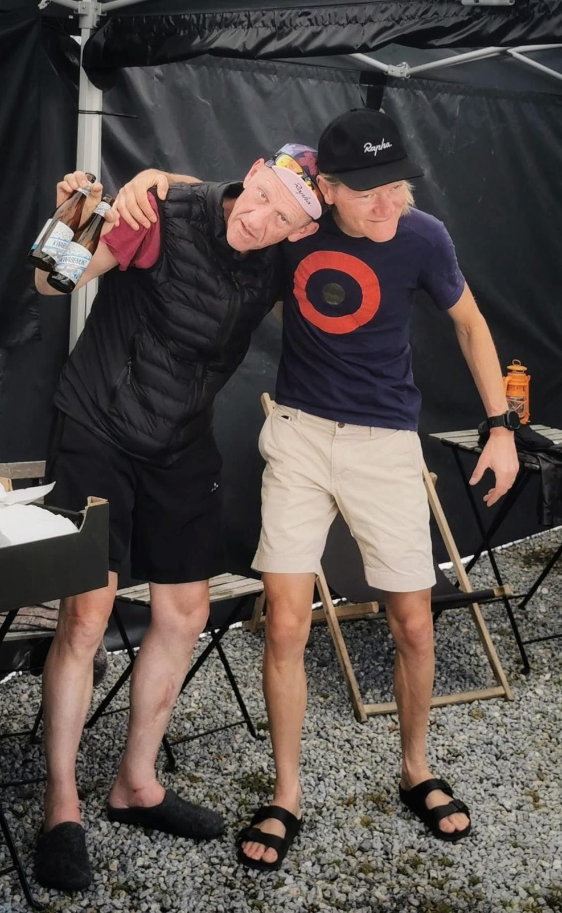

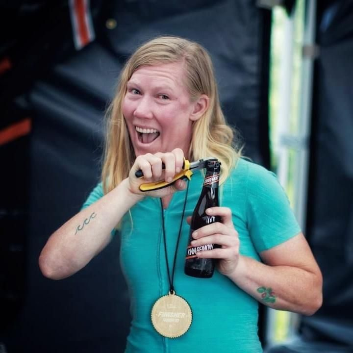

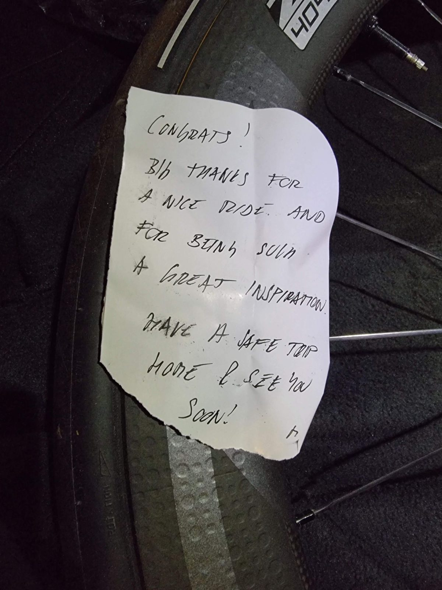

Tusen tack alla, nämnda som onämnda ❤ Inte minst de ~8 000 unika dot watchers som följde loppet live!

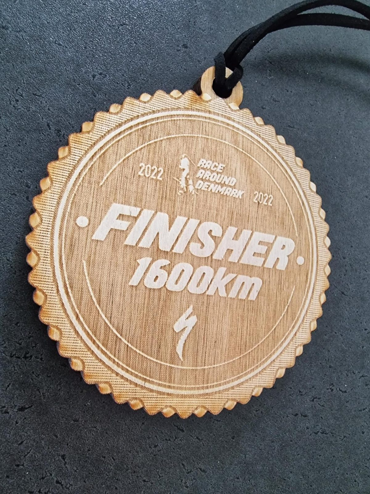

[Strava 🔗](https://www.strava.com/activities/7225169990)
