*English version: [RatN 2026](../ratn-2026)*

| | |
|---|---|
| **Lopp** | RatN 2026, Amerongen, Nederländerna |
| **Datum** | 2–7 maj 2026 |
| **Distans** | 1 951 km / 5 273 hm |
| **Format** | Unsupported |
| **Cykel** | Open U.P. 2023 |
| **Resultat** | 16 av 127 (35 % DNF) |
| **Total tid** | 112:47 (rulltid 81:33) |
| **Totalsnitt** | 17,3 km/h |
| **Rullsnitt** | 23,9 km/h |
| **Vilo-%** | 28 % |
| **NP** | 132 W |

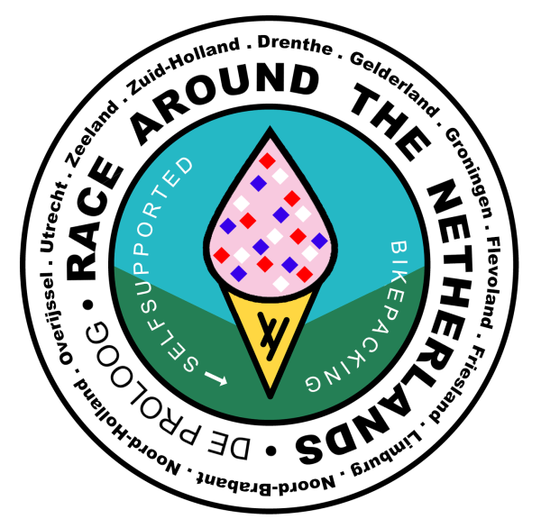

## TL;DR
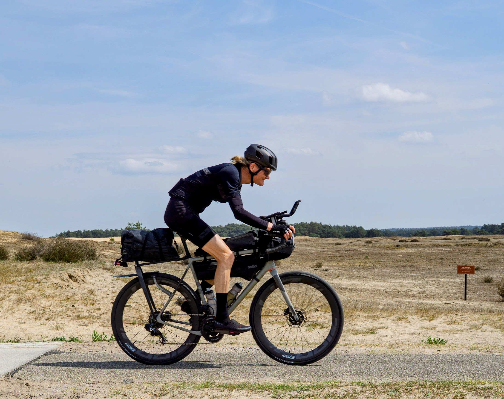
Min återkomst efter RAP 2023 och tre års tävlingsuppehåll blev plats 16 av 127 startande på RatN (1 951 km / 5 273 hm, totaltid under 113 timmar). Rutten är mestadels härlig cykelinfrastruktur (förutom rikliga mängder fårbajs) med mycket navigerande. Vädret slog snabbt om från sommarvarmt till kallt och blött. Största tidstjuvarna blev el-strul med trilskande telefoner och cykeldatorer. Bristande träning och fitness kostade 110-timmarsplanen, men jag hade realistiska förväntningar. Arrangören Adventure Bike Racing levde upp till sitt namn tack vare en härlig rutt i ett fantastiskt land, blev det ett häftigt äventyr. Jag måste tillbaka till Amerongen och De Proloog 2028!
## Prolog
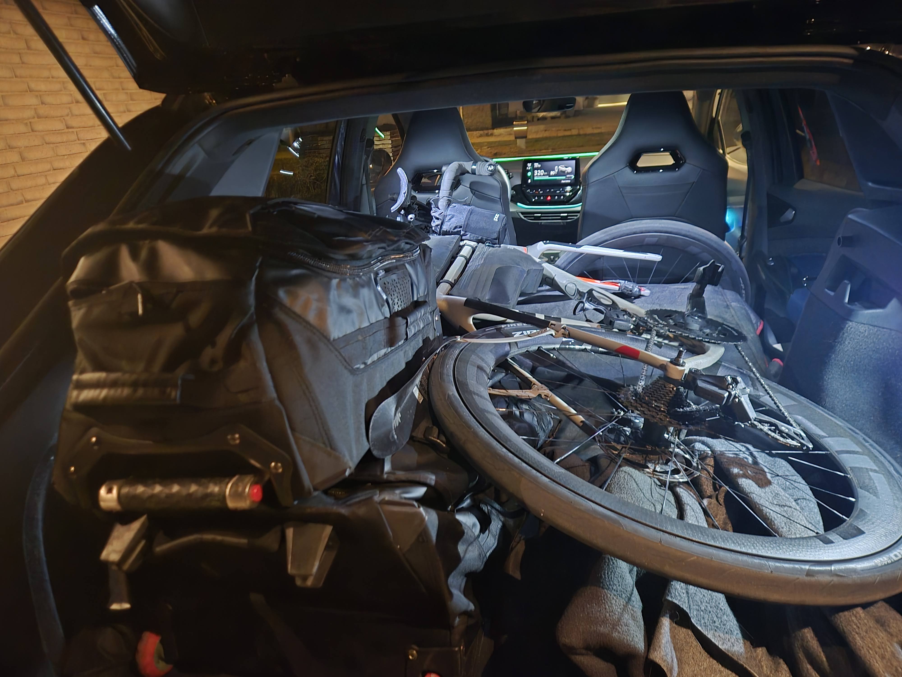
P.g.a. betydande så kallade _work-life_-utmaningar har jag inte tävlat sedan jag genomförde mitt livs tuffaste lopp, Race Around Poland (360 mil / 33 000 hm) 2023. I samband med processen som ledde till min nuvarande anställning nämnde jag min hobby ultracykling och att jag bl.a. DNS:at både RatN och B-Hard p.g.a. jobbet för en annan _executive_ som intervjuade mig och hen sa att RatN skulle jag definitivt köra. Sagt och gjort. Det har dock inte varit lätt att hitta tid till träning och planering.

## Rullsnitt/Effekt
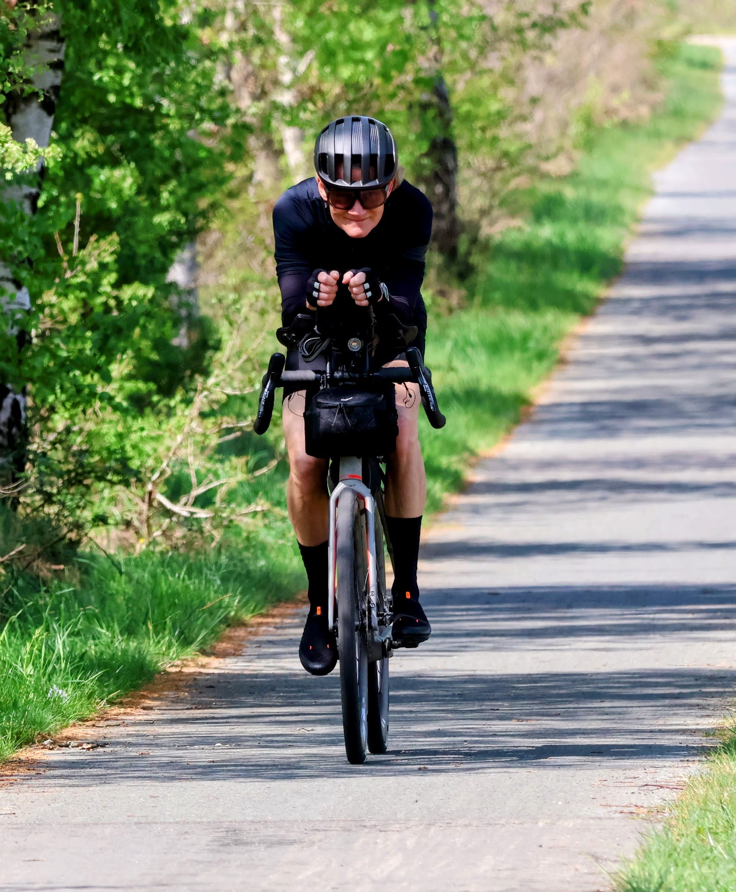
Detta var mitt stora planeringsfel. Jag hade räknat med ett rullsnitt på 25 km/t, men det landade på 24 km/t. Man kan skylla på en relativt långsam rutt på knixig cykelinfrastruktur med varierande underlag och mycket regn, men siffrorna talar sitt tydliga språk: Jag gick in i loppet långt ifrån mina glansdagar åren 2019 - 2023 då jag kunde hålla 150+ NP under liknande förhållanden och effektmätaren uppmätte 12% lägre än det. M.a.o. hade 110-timmarsplanen med råge klarats om dessa 3 t 15 min hade hyvlats av sluttiden. 

Definitivt en lärdom att inte överskatta sin verkliga förmåga och extra surt då min fantastiska hustru istället för att vänta med race director Michael vid torget utanför De Proloog efter midnatt hade gjort det samma i kvällssolen vid niohugget och jag kunde fått en riktig måltid istället för Jumbo-färdigrätt på rummet.

## Kroppen
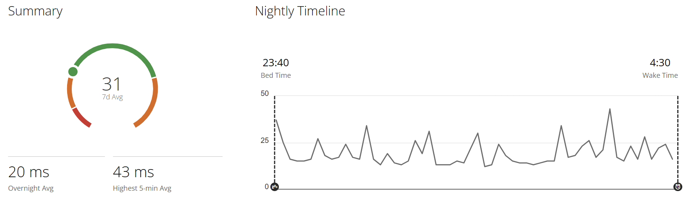
Gick in i loppet med en pågående Voltaren-kur för ömt knä och ett ljumskbråck som blir sämre dagligen. Tillsammans med ungefär halverad träningsmängd jämfört med min storhetstid var jag minst sagt nervös. Hade mycket riktigt krämpor första 15 milen, både i knät men också ländryggen. Sen var det som att kroppen kom ihåg hur man cyklar ultra och allt blev mycket bättre. Vaknade dock med ömma knän och ben efter första sovstoppet efter två dagars cykling. Kände mig inflammatorisk, och hade mycket låg HRV. Som förväntat, men tufft att dra igång igen.

Många upplever krämpor redan efter kortare lopp som PBP:s 120 mil medan min komfortoptimerade cykel samt någorlunda långa nattrestitution gör att jag brukar klara mig bättre än de flesta, särskilt när jag cyklar i touringsandaler och inte stenhårda kolfibersulor som denna gång. Efter ett par dagar börjar loppet ta ut sin rätt och nacken började ömma och fötterna gjorde stundtals detsamma. Väl hemma tog ett par veckor innan tårna kändes helt okej igen, men inga större problem. En större sadelsår upptäckte jag också väl hemma, men inget som störde nämnvärt under loppet. Annars kör jag fortfarande med Crotch Guard istället för traditionellt byxfett.

## Rutten
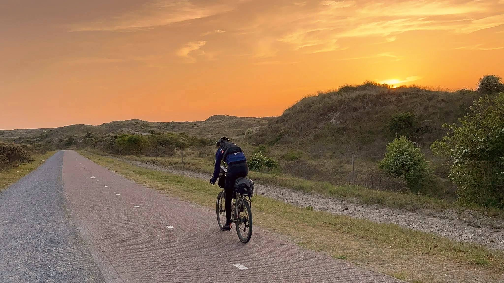
En av loppets stora styrkor, mestadels cykelinfrastruktur, är självklart också en fiende avseende hastighet med varierande underlag, från den slätaste asfalt till kullersten och lite allt möjligt däremellan. Addera många cykelbanor som plötsligt byter från den ena sidan av vägen till den andra = dubbla 90°-graderssvängar och överlag mycket att förhålla sig till navigeringsmässigt. Som jämförelse: en jämförande analys av RatN vs. Sverigetempot (båda ~2 000 km) ger ca **51 svängar ≥60° per 100 km** för RatN mot **10 per 100 km** för Sverigetempot; drygt fem gånger så många. Jag välte t.o.m. i en trafikljus- och rälskorsning med mycket folk och oklart navigeringsläge då jag inte hann klicka ur. Kunde kostat loppet, men nu mest sårad stolthet några hål i benvärmaren och ett par större skrubbsår.
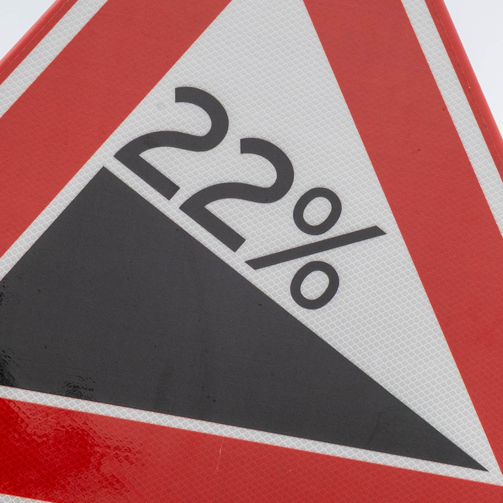

[Rutten i original från arrangören på Komoot](https://www.komoot.com/collection/1301218/-race-around-the-netherlands-classic)

## Loppet
De flesta ultracyklingslopp (det finns ingen exakt definition, men låt oss dra gränsen vid 120 mil) har ofta en betydande DNF-%, d.v.s. deltagare som inte lyckas genomföra loppet. Årets utgåva av RatN var hård och fler än en av tre lyckades inte ta sig tillbaka till målet i Amerongen och många behövde väldigt lång tid för att göra det. Årets utgåva får därmed anses vara hård, men samtidigt långt ifrån RAD (Race Around Denmark) som jag genomfört sex gånger och också haft ett par podieplatser som i år veckan efter RatN i ännu värre väder såg hela nästan två av tre i 1 600 Unsupported tvingas bryta. Kom förberedd! 

Härlig stämning på och runt De Proloog innan och efter loppet. Bara glada miner och tillrop utefter banan, inklusive min favorit "*nice rig man!*" och en deltagare som öste lovord över min cykel och dens bestyckning när vi kommit ur nationalparken Hoge Veluwe. Många dotwatchers på banan som hejade, plåtade och filmade. Min lillebror skickade t.o.m. ut en affärsbekant i ösregnet för att fota och växla några ord i Limburg. Hej lillebror-foto nedan. Superkul och det som gör ultracyklingstävlingar så mycket roligare än att nöta brevetcykling i det anonyma. 

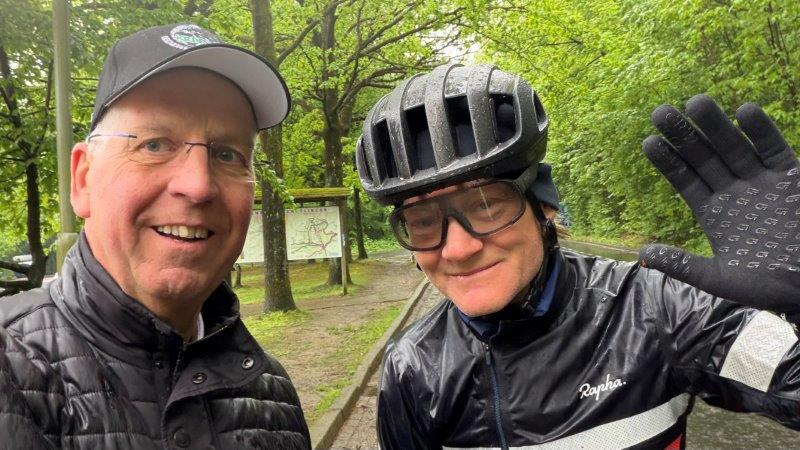

## Vatten
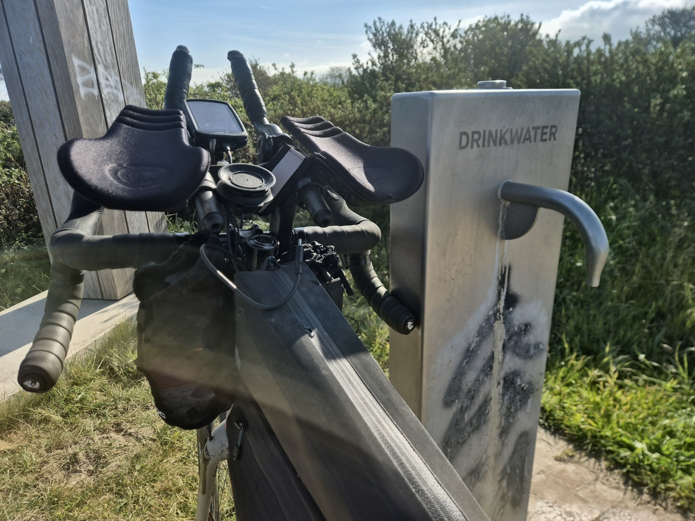
Jag hade varnats av en vän och tidigare deltagare samt i racebook:en om att rutten hade långa partier med begränsad tillgång till vattenpåfyllning, så jag var lite extra orolig, då min nya ramväska inte tillåter 95 cl-litersflaskor under sig som den förra, så jag nöjde mig med 2 x 72 cl Podium. Tog med en halvliters Camelbak softflask, men den använde jag aldrig. Såg ganska många som körde med fyra flaskor och det är kanske en smart strategi både avseende risk och tidsoptimering, men jag hade aldrig problem med vattenförsörjning. 

## Boenden
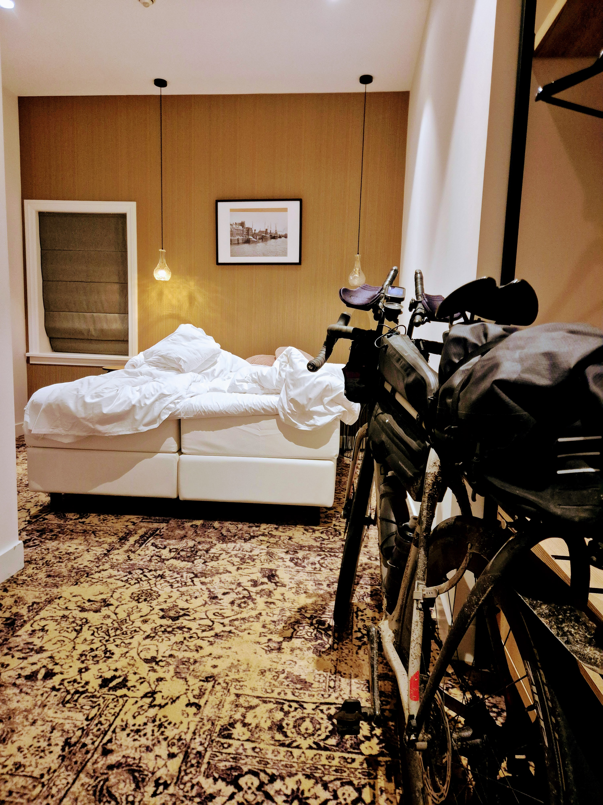

Första nattens B&B var smidigt förutom incheckningen som skulle äga rum personligen och inte medelst nyckelskåp, vilket gjorde sista tre milen i hård motvind utefter havet mycket tuffa. Annars smidigt med ett gemensamt kök då flaskorna behövde diskas p.g.a. allt fårbajs. Andra nattens fina hotell bjöd på en mycket tråkig överraskning. Jag trodde att Nederländernas cykelvänlighet även innefattade hotellen, men detta hotell var mycket cykelovänligt. Efter långa överläggningar fick jag dock till slut lov att nedgradera mitt rum och ta in cykeln. Det är inte bara det att den är en resväska på två hjul med mycket som ska laddas och fixas, hygienartiklar, etc. men också att få ut en cykel ur ett förråd eller dylikt mitt in natten innan avfärd kan vara mer eller mindre klurigt och tidstjuvande. Tredje natten var jag en timme sen och utöver vänta tio minuter på nattportiern som inte var på hotellet och 18 € i sen incheckning-avgift var det inga som helst problem med vare sig cykel eller något annat.

## Sömn
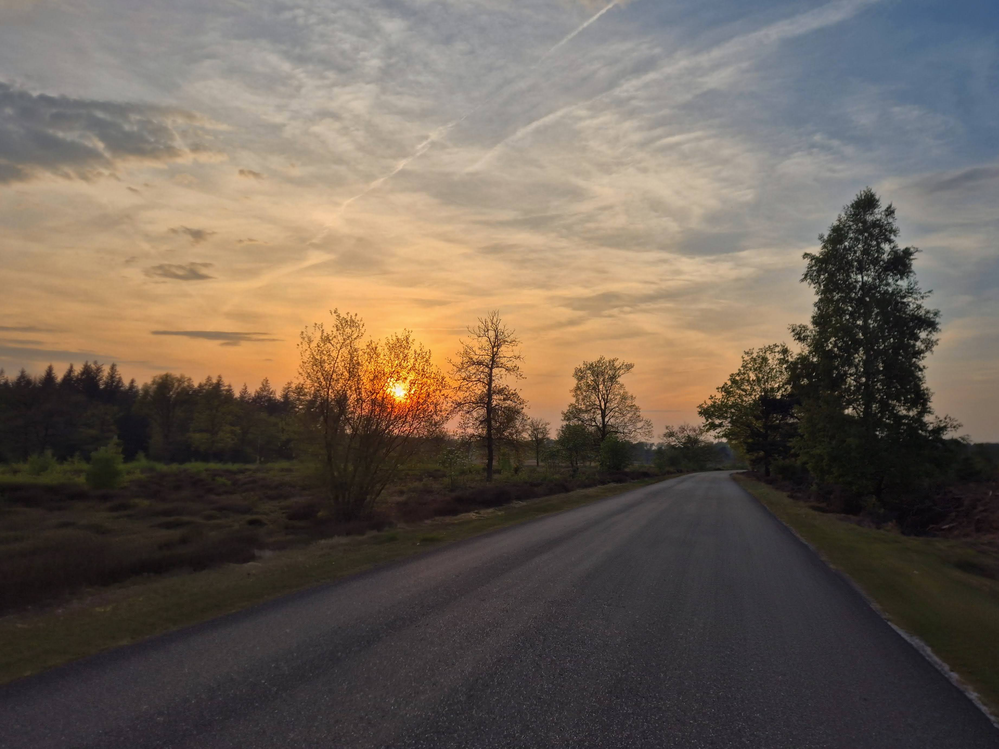
Vid denna typ av lopp, låt oss kalla dem mellandistans, är som regel bästa sömnstrategi att cykla igenom första natten utan sömn. Jag var dock tämligen övertygad om att det skulle bli svårt om inte omöjligt, då sömnmängd och -kvalitet varit lidande, med en lång arbetsdag på B&B:et och endast sex timmars sömn dagen innan loppet. Mycket riktigt tog detta ut sin rätt och jag utnyttjade en busskur från mina vägnoter till tandborstning och en halvtimmes sömn sittandes i min dunjacka för att inte frysa för mycket.

Resten av loppet hade jag planerat tre inomhussovstopp på hotell och B&B och då tre sömncykler (~4,5 timmar) varje natt. Denna plan hölls nästan perfekt och det blev totalt ~14 timmars sömn från lördagens morgonstart till onsdag natts målgång. Nästan komiskt att kroppen ställt in sig på detta och jag inte kunde sova mer än tre cykler natten efter heller och jag därmed fick en fin promenad och meditation i Amerongen innan frukost och Malins uppvaknande. Tur att jag inte var chaufför den dagen...

## Väder
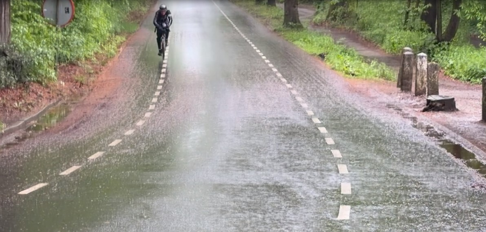
Lördagsmorgonen var kylig men väldigt vacker. Under dagen gick temperaturen upp till 28° under gassende sol och det kändes nästan som att vara tillbaka i varma lopp söderöver. Detta skulle snabbt ändra sig och lejonparten av loppet var kallt och till stora delar blött. Sista dagen var mycket våt och regnkläderna åkte aldrig av. Två gånger fick en snustorr kedja en rejäl omgång Silca-olja.

## Elektronik
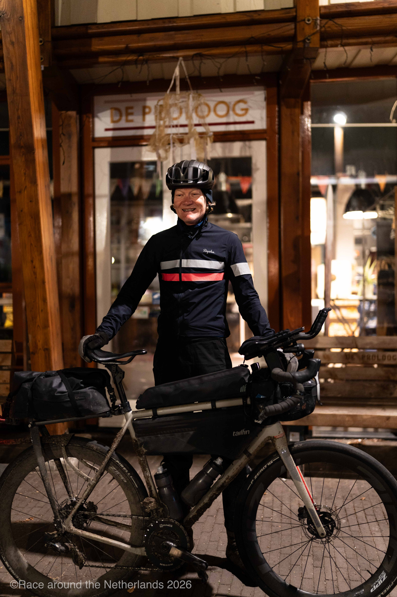
Loppet var som sagt blött, men redan vid en fuktig vårnatt vägrar Samsungs S-telefoner ladda, vilket ställer till stora problem under lopp och äventyr. Hade ytterligare en S-telefon med mig som backup, men hade glömt att båda SIM-korten nu var av e-typ. Tidigare har jag tejpat fast en SIM-nål på baksidan av backup-telefonen. Har jobbat med mjukvaruutveckling och digitalisering hela min karriär, men fysiska lösningar är ibland överlägsna. 

Inte ens efter andra nattens innesovande med S24:an inlindad i ett torrt täcke tog den laddning. Lyckades även slå på TalkBack, så gudskelov för lösenordsfritt wifi och andratelefonen då jag till slut hittade en YouTube-video som förklarade hur eländet slogs av. Ovanligt lite plåtande och musik-/poddlyssnande denna gång, då telefonen som regel var i flygplansläge eller helt avstängd. 

En elektronikolycka kommer sällan ensam, så för första gången la min Edge 1040 Solar av med mindre än tolv mil till mål. Efter några ofruktsamma återupplivningsförsök tog jag fram backup:en, en ganska ny Edge 1050. Tro det eller ej, men med 5 km till mål fick den nån slags evighetsomstartstuppjuck. Återigen; efter för många försök att få bukt med det togs 1040:n fram som nu gudskelov gick att få liv i. Ovanstående avspeglar sig i "strecket" när man tittar på min rutt på Strava.

Sist med inte minst hade jag som sedvanligt gjort mina elförbrukningsberäkningar, men särskilt det nya Lupine-framlyset drog mycket mer än beräknat, så kl. fyra på morgonen andra dagen var jag helt utan ström från kraftbanken och tejpade fast backup-framlyset på den andra tempopinnen. 

Väl hemma noterade jag att ena baklyset inte längre går att ladda och att USB-porten som "rörde på sig" under loppet helt enkelt betydde "jag är trasig". Trackern var heller inte fulladdad vid loppstart, men tog laddning utan strul.

Några lärdomar. Mät strömförbrukning istället för att beräkna den. Använd större kraftbank än du tror dig behöva. Ha trådlös laddning till telefonerna. Ladda trackern innan start. Ha alltid backup:er med för kritisk el, oavsett om loppets regler kräver det eller ej.

Elstrulet var utan jämförelse loppets största irritation och oförutsedda tidstjuv.

## Cykel
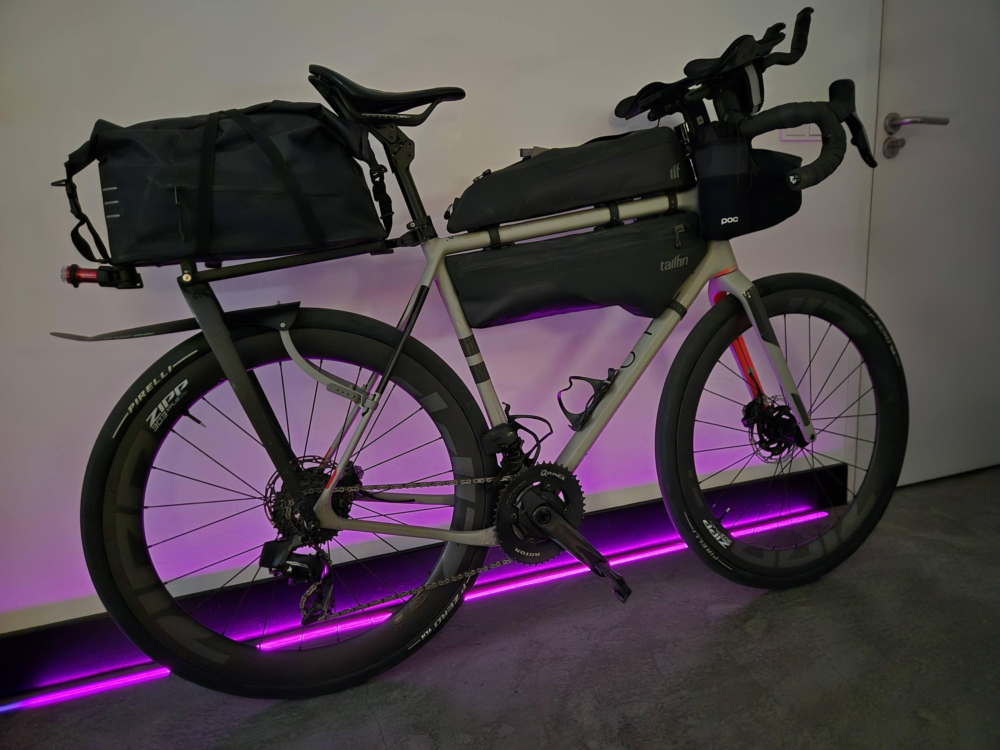
Byggde en Open U.P. för maximal komfort inför RAP (Race Around Poland) 2023 och jag valde att gå efter komfort och inte maximera hastighet och lida och riskera domnings-/vibrationsskador, Shermers neck och annat otrevligt. Som jämförelse dyker många med höga ambitioner upp till dessa lopp på extrema aeroräsercyklar och t.o.m. tempojonnar. Har cyklat det längre Sverigetempot på min Cervélo S3, men det går också på snabbrullad och bekväm landsväg. Sedan 2023 har Zipp släppt superbreda Firecrest XPLR och Pirelli mina betrodda P Zero TLR i 40 mm. Vilken drömkombo med lågt tryck! Vidare bytte jag ut samtliga väskor, förutom min älskade Tailfin-väska/-pakethållarkombo. Styrväska och matpungar från POC och Tailfin-väskor över och under toppröret. Funkade mycket bättre än tidigare lösning från Apidura och Cyclite. Trots de tuffa backarna runt Limburg valde jag min normala utväxling, ovala 48/35 Q-rings och en 33-10-kassett. I tuffaste laget då backarna kommer sent i loppet och det spöregnade, men ändå värt att cykla med beprövade grejer och fina täta steg resten av loppet.

## Kläder
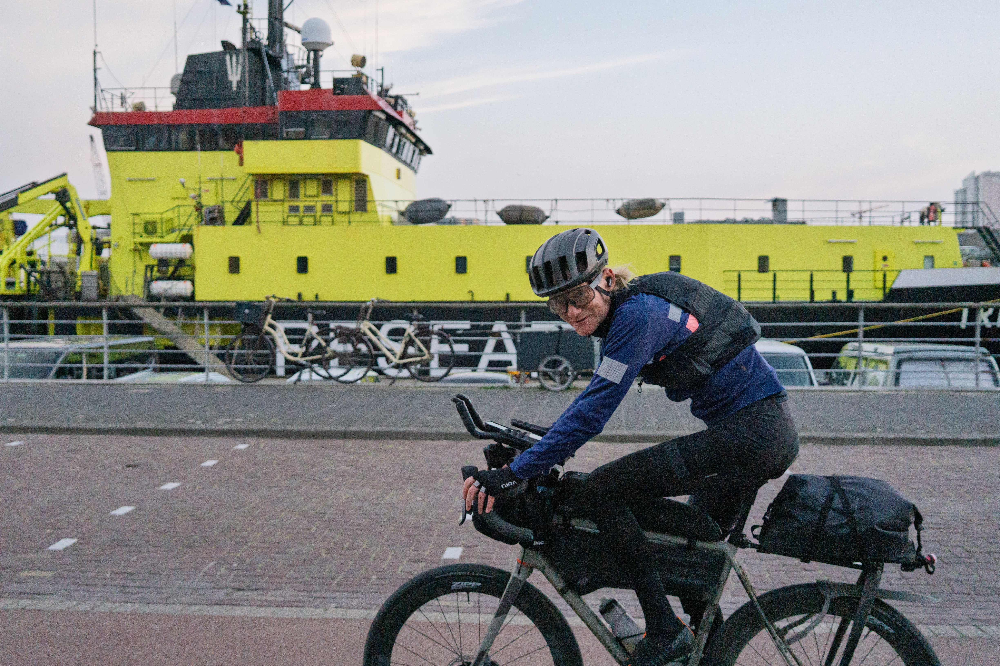
En merinotisha valdes som underställ p.g.a. lukt och väderlek. I övrigt klassik lager-på-lager-taktik inklusive ett sista lager Gore-Tex-jacka och -byxor som tyvärr kom till mycken användning. Även dunjackan kom till undsättning vid den korta sovpausen. Har tidigare fått svåra utslag av kontaktallergi p.g.a. silikonet som håller mina merinoarmvärmare på plats under kyliga RAD. Har aldrig behövt använda benvärmarna länge nog för att det skulle bli ett problem även där, men nu cyklade jag lejonparten med dessa på och vid hotellet utanför Rotterdam upptäckte jag riktigt fula och stora utslag på benen. Lösningen blev att köra resten av loppet med dem ut-och-in. Använde samtliga medhavda kläder förutom Windstopper-shortsen jag brukar ta med för kall och torr nattcykling. 

Lista: Rapha Cargo bibs, Gore Gore-Tex-kepa, Rapha merinomössa, Rapha merinotisha, 2x Silca-strumpor, Rapha merinobenvärmare, Rapha skoöverdrag, Grip-Grab regnskoöverdrag, Grip-Grab regnhandskar, Rapha Pro-Team arm screens, Rapha långa brevethandskar, Giro korta handskar, Rapha lightweight short brevet jersey, Rapha long brevet jersey, Rapha Gore-Tex Infinium long brevet jersey, Rapha Gore-Tex brevet regnjacka, Gore Gore-Tex regnbyxor, Bookman reflexankelband (obligatoriska, liksom rikligt med reflexer på cykel och hjälm) och till sist hjälmen POC Cytal Carbon med passande POC Aspire Photochromic. En ny rygga fick det bli också - Albion Visibility Cargo Vest.

Ju varmare lopp, desto större problem med *hot foot*. När tempen gått över 40° i Italien, har det varit outhärdligt, men även snabba sextiomilare runt 30° har varit förfärliga. Därför gick jag över till att cykla i sandaler under dylika villkor för några år sedan, bl.a. RAP och 1001 Miglia. Förväntade mig dock betydligt lägre temp i början av maj i Nederländerna, vilket med undantag för första dagen visade sig vara korrekt och mitt val av Kéo och mina supersköna DMT KR SL med snörena borttagna var helt rätt val, även p.g.a. att de är "hala" vilket gör att skoöverdrag lätt tas av och på. En gnutta ökad gåbarhet då hushållets samtliga Kéo-klotsar bytts till Vibram XS.

## Nutritionsplan

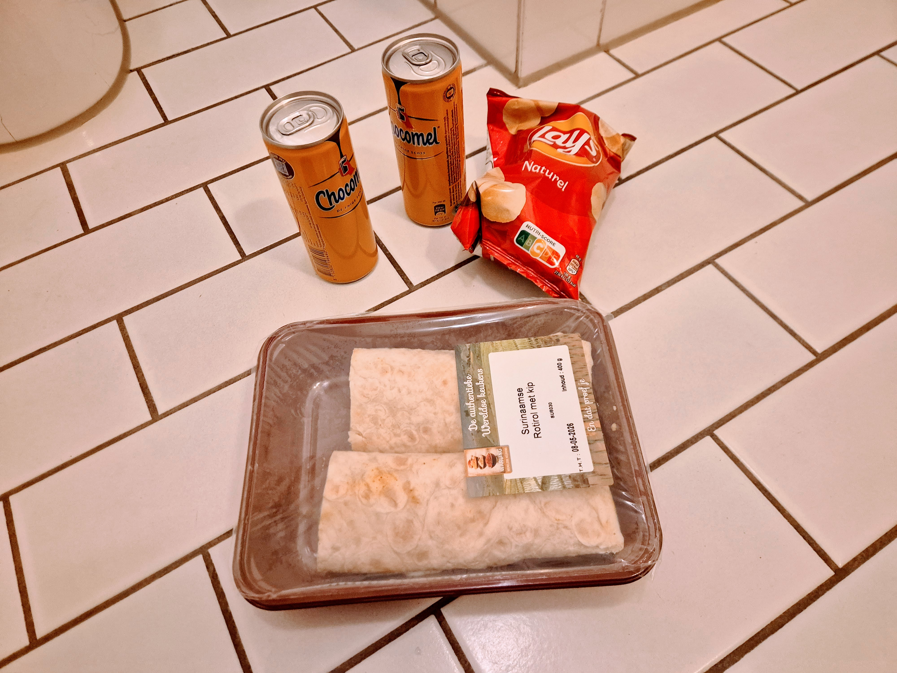

Ett platt lopp med all klättring i slutet och inga bagdrops är själva receptet på att ta med så mycket energi som möjligt från start. Hade tänkt 60 Maurten 40g-gel och lika många Sponser Coconut-Macadamia Liquid Energy Ultra då förstnämnda maxar kolhydrater per viktenhet och sistnämnda är en beprövad ultracyklingsenergikälla. Sponser var dock mycket svår att få tag i och enda stället den gick att beställa kunde inte leverera (men försökte behålla mina 400 € vilket är liten historia i sig själv). Fick i sista minuten byta strategi och tog med 80 Maurten och 12 Nutridrink Compact och tänkte förlita mig på att komplettera med mycket chokladmjölk, stycksaker, kex och enstaka måltider "riktig" mat, helst runt sänggående, både för att hålla mig rullande men också p.g.a. sömnkvalitet och matsmältning. Planen hölls till punkt och pricka.
## Fårbajs
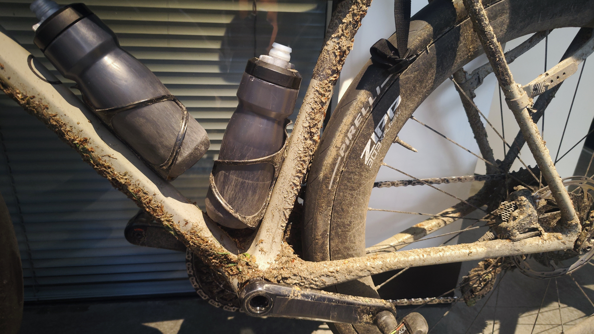

Jag hade varnats för fårbajset, men det översteg mina vildaste mardrömmar. Trodde det var över efter 12 km i kletet och stannade för att torka av skor och ben, men då var det kanske tio mil kvar… Hade lyckligtvis förberett mig genom att montera stänkskärm samt ta bort min "verktygslåda" som annars sitter nere vid vevpartiet. Ringde under loppet min hustru och bad henne köpa rikligt med rengöring på Jumbo så att vi kunde ha cykeln i bilen efter målgång. Trots en rejäl rengöring luktade bilen inte gott i sommarsolen som återvände dagen efter målgång.
## Mage
Jag har varit öppen med att jag liksom många andra ultracyklingsutövare kämpar med det gastrointestinala. Även om även detta lopp hade sina utmaningar på området och plötsligt uppdykande bajamajor bokstavligt kom som räddare i nöden, var det ett av mina absolut bästa lopp i detta avseende. 

## Epilog

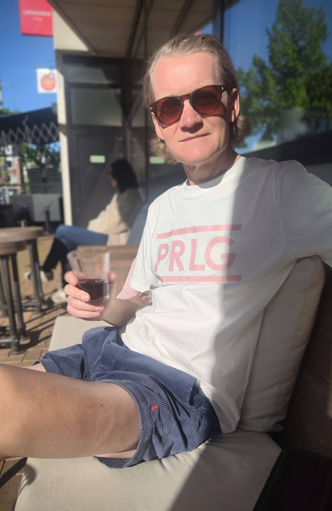

Otroligt positivt överraskad av hur fint landet och rundan var. Minst 80% av tiden känner man sig helt trygg på cykelinfrastruktur. Många, långa partier är ren propagandacykling i ett fysiskt vykort - nationalparker, sanddyner, vallar, små som stora städer, slussar, långa utefter-vattnet-sträckor. Mitt härligaste lopp dags dato trots kyla, regn och inte minst rikliga mängder fårbajs. Jag måste tillbaka till De Proloog, Amerongen och RatN 2028! Jag drömmer också om ABR:s "stora" lopp [Around Norway](https://www.adventurebikeracing.com/product/around-norway/) som huvudlopp 2027.

Strava, annars har det inte hänt! 

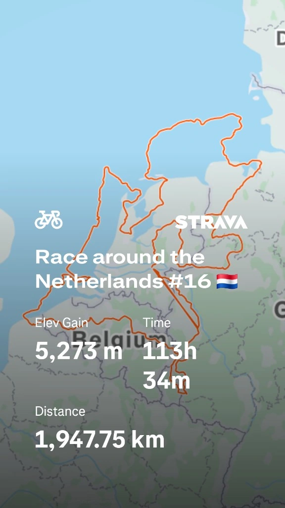

[Strava 🔗](https://www.strava.com/activities/18408729415)
