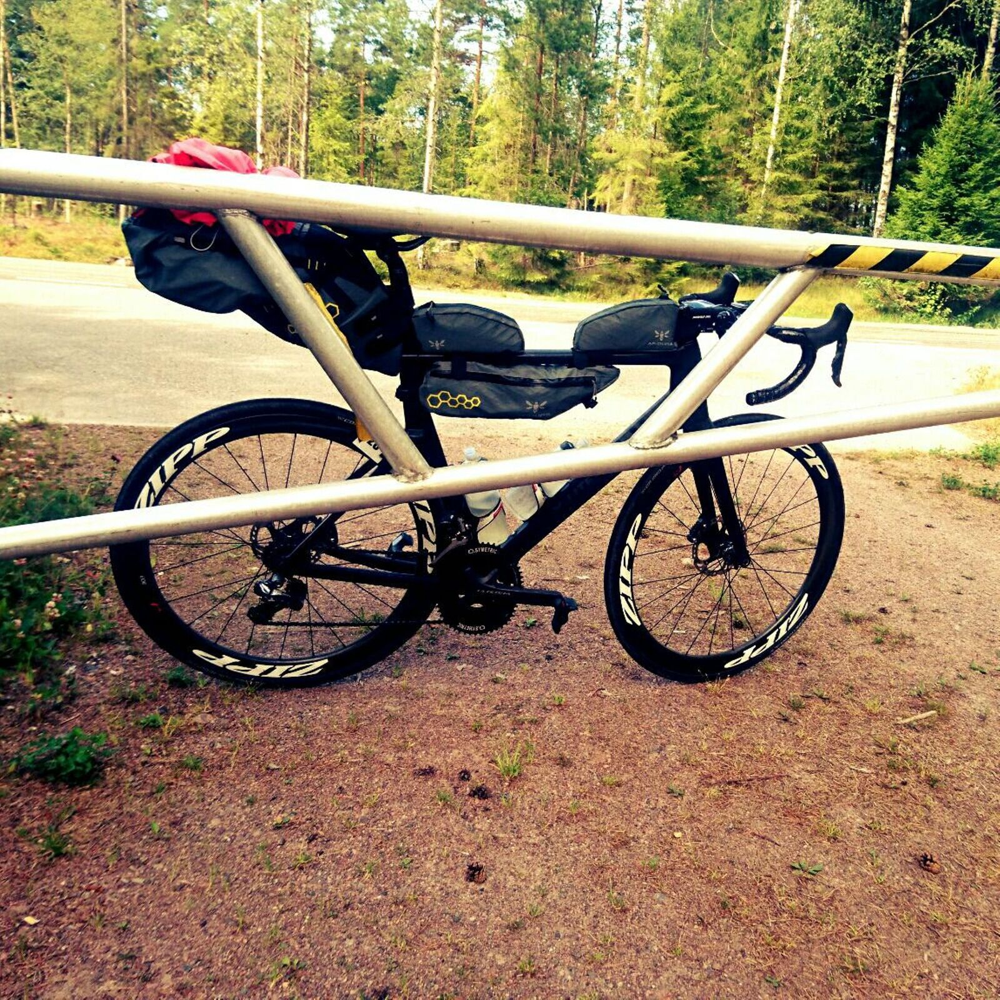
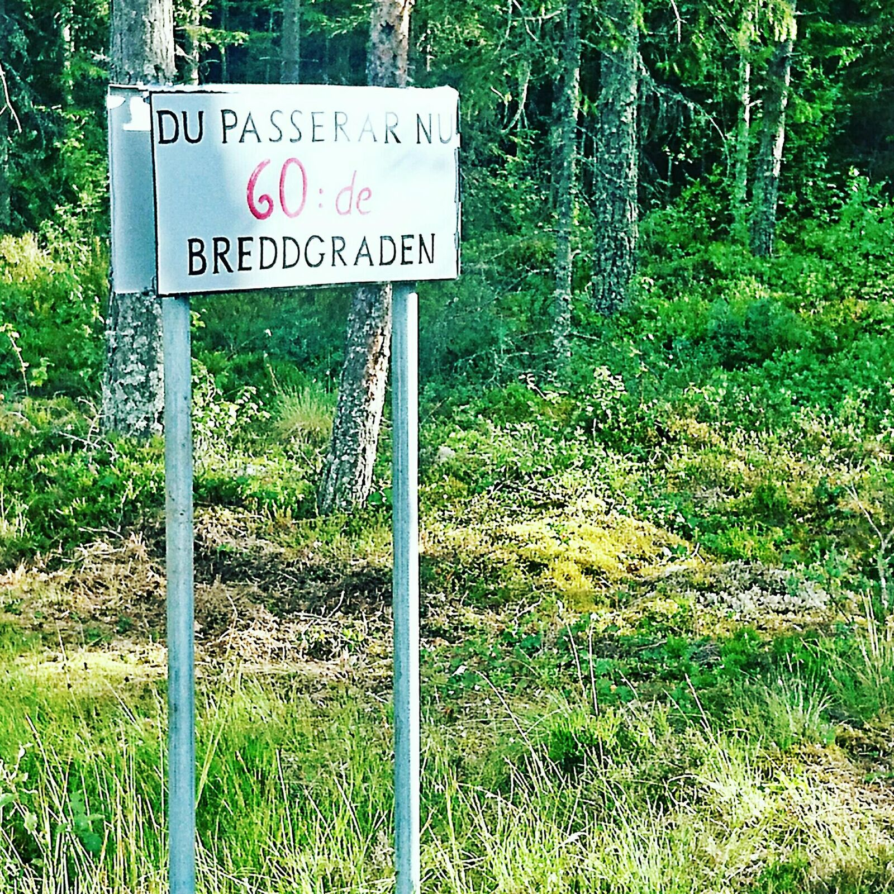
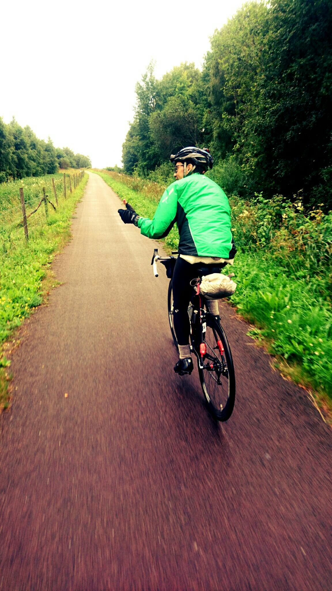
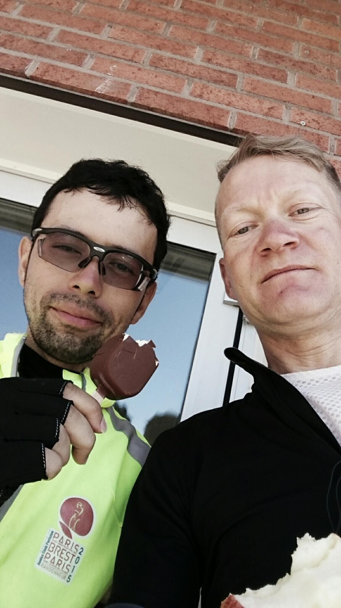
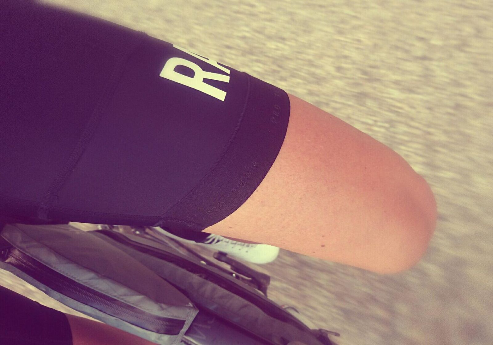

*English version: [Sverigetempot 2016](../sverigetempot-2016)*

| | |
|---|---|
| **Lopp** | Sverigetempot (Length of Sweden) 2016, Katterjokk–Smygehuk |
| **Datum** | 16–22 juli 2016 |
| **Distans** | 2 135 km |
| **Format** | Unsupported |
| **Cykel** | Rose X-Lite CWX |
| **Resultat** | 10:e |
| **Total tid** | 151:56 (rulltid 84:01) |
| **Totalsnitt** | 14,0 km/h |
| **Rullsnitt** | 25,4 km/h |
| **Vilo-%** | 45 % |

Skulle köra solo och bara satsa på att komma i mål, men var ju tvungen att hinna hem till bad och grill med familj och svärföräldrar så en tiondeplats blev det :-)

[Strava 🔗](https://www.strava.com/activities/650452209)
