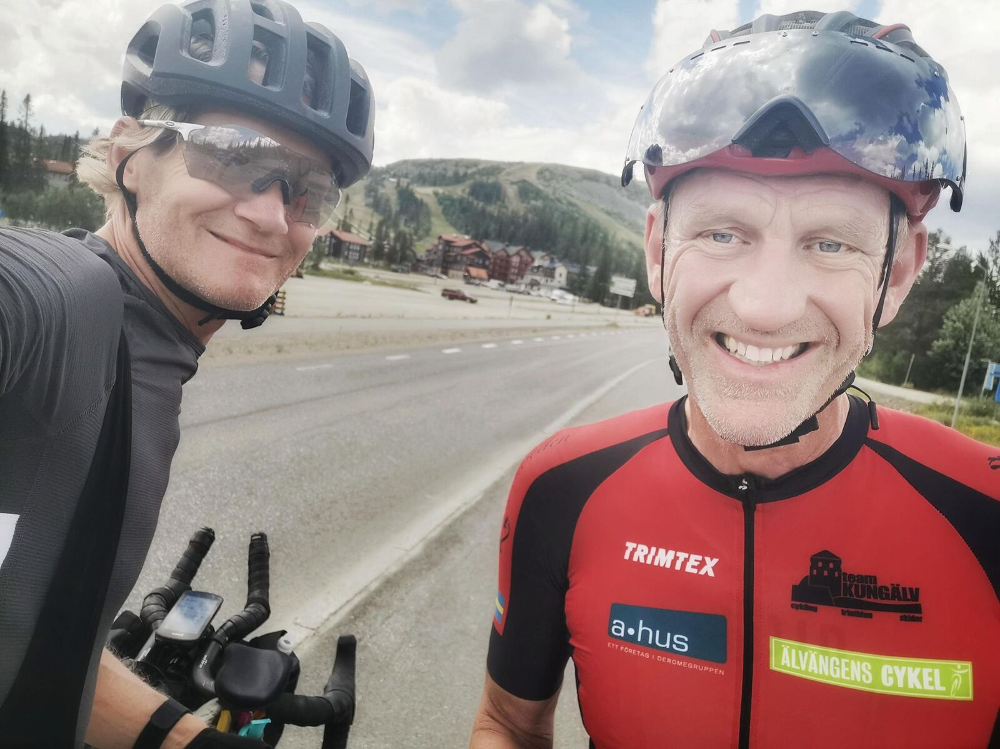
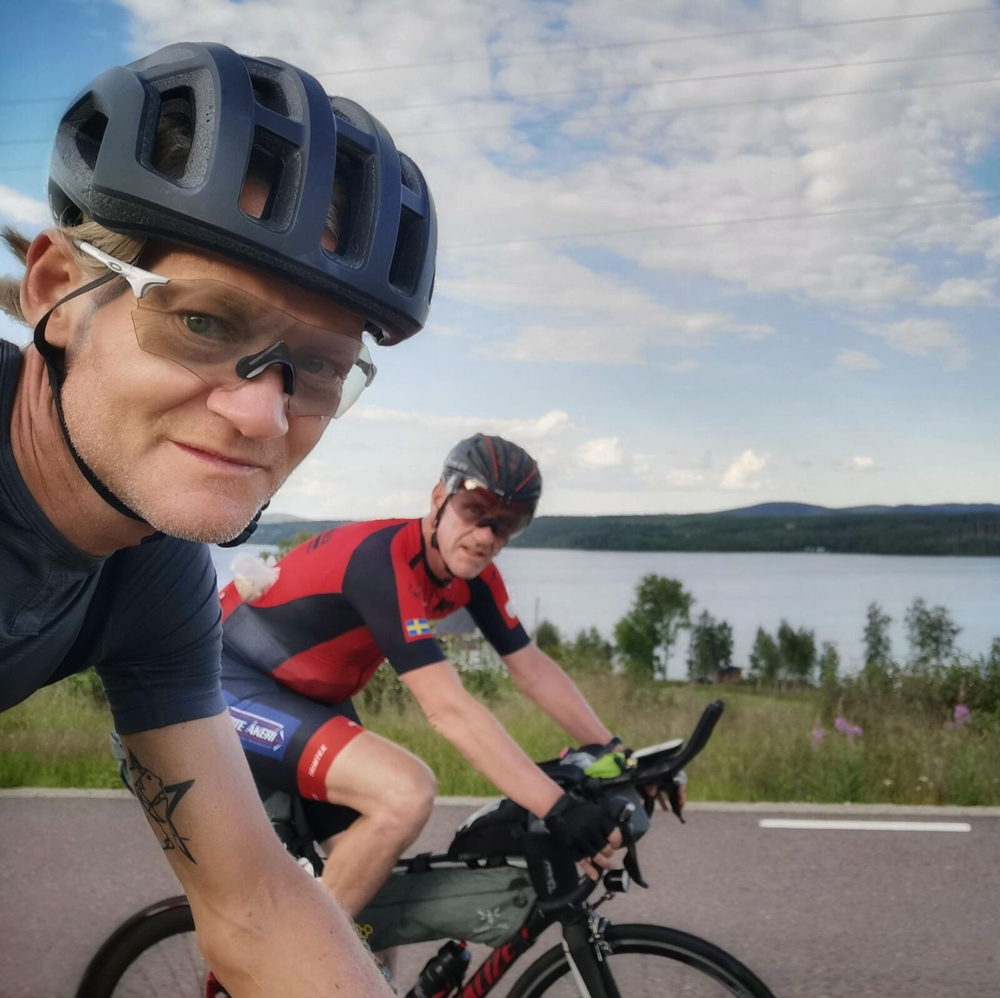
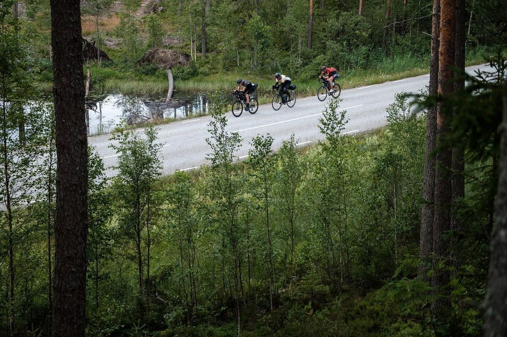
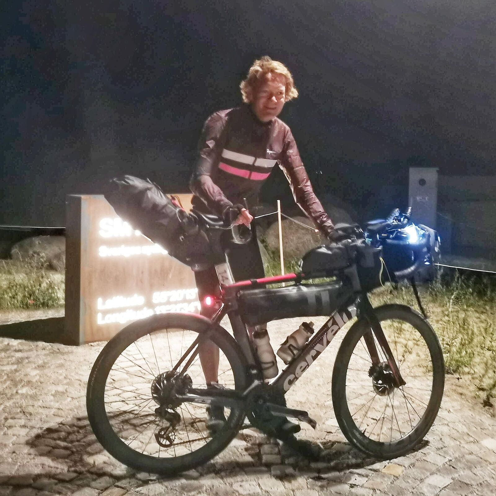
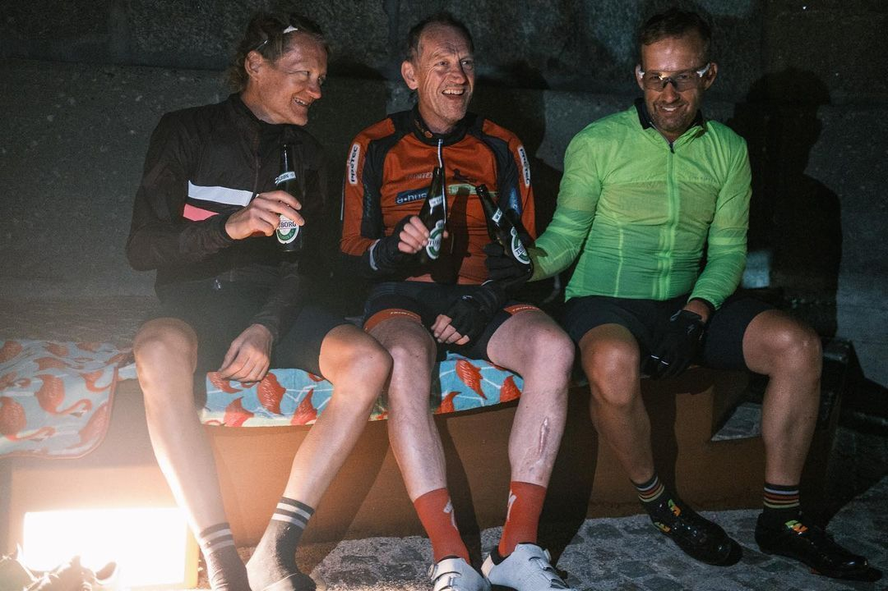

*Svensk version: [Sverigetempot 2021](sv/sverigetempot-2021)*

| | |
|---|---|
| **Race** | Sverigetempot (Length of Sweden) 2021, Katterjokk–Smygehuk |
| **Date** | 3–8 July 2021 |
| **Distance** | 2,123 km / 15,870 m |
| **Format** | Unsupported |
| **Bike** | Cervélo S3 |
| **Result** | Joint 2nd of ~120 |
| **Total time** | 112:24 (moving 80:14) |
| **Overall avg** | 18.9 km/h |
| **Moving avg** | 26.5 km/h |
| **Rest %** | 29 % |

## The start

What a ride! Came to ride alone as per usual, but the joint start saw quite a few of us thundering down to Kiruna. Thereafter, riders dropped off either according to different plans or other less fortunate reasons.

## Midnight sun

Felt great and asked Per and Micke to join me and my plans to ride the 950 k to Östersund in one stretch and experience the midnight sun instead of sleeping in Arvidsjaur. Unfortunately Micke got cramps, but Per and I joined forces and the idea of sharing the whole ride formed.

Exhausted, we finally arrived at the combined control and hostel and got two meals but less sleep than planned for various reasons. The heatwave gave us an hour or two of respite when we left around 7 am.

## The heat

The battle against the heat and headwinds took its toll, and somewhere I think we slowly realised that our stretch goal of reaching a hotel in Falköping ~770 k away was a bad idea, but we stupidly pushed on until we were so fatigued that we couldn't ride and every short break made us the perfect mosquito feast.

## Fredriksberg

After a rather horrible night, we finally reached Fredriksberg and hoped for a bed but none could be found. Instead breakfast at the best "fik" in the world, a nap on a wharf, a second breakfast and onwards!

## The trio

A few miles in, the locomotive engine Roger rode up to us after having gotten the news of our departure from a club mate of mine. We asked him to join us for the rest of the ride, and the duo became a trio.

After a wet and cold night we finally reached the hotel, and unanimously decided to both sleep long and have a long breakfast before the final +400 k leg to Smygehuk.

## Smygehuk

Wednesday greeted us with very nice cycling weather (apart from the southern headwinds that'd plagued us for days on end). Fatigue, saddle sores and other hardships slowly set in, and after the rollercoaster ride of our lives (both literally and figuratively) we reached Smygehuk Thursday 01:20 am, 112 h 20 min after the departure from Katterjokk.

2,121 k, 12,850 m of climbing and the length of Sweden conquered, and a joint second place as well. Thanks for the ride guys! ❤

[Strava 🔗](https://www.strava.com/activities/5595455122)
