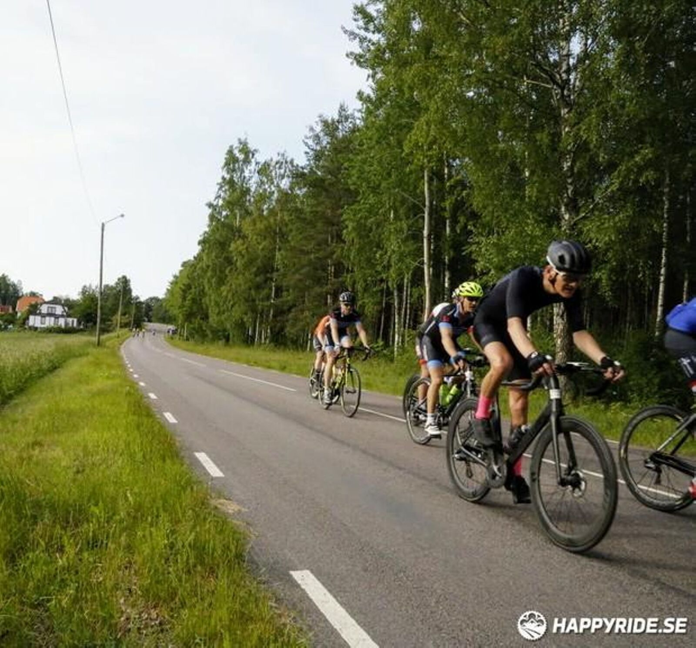
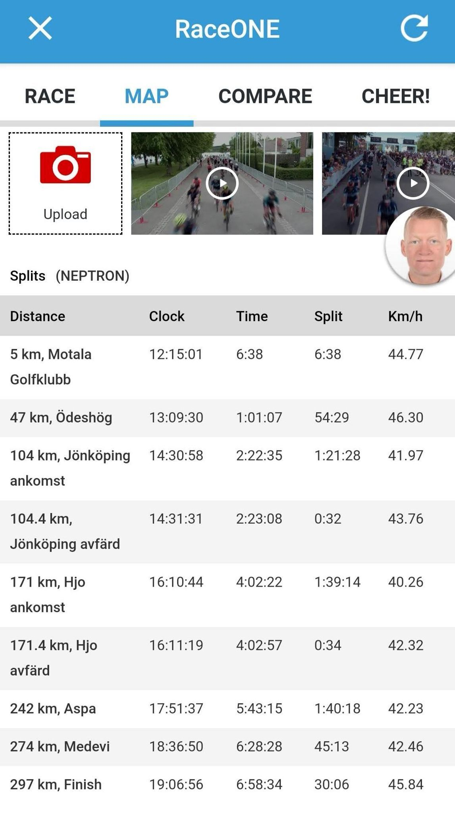
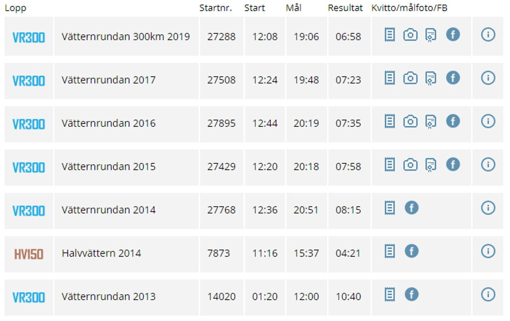

*Svensk version: [Vätternrundan 2019](sv/vatternrundan-2019)*

| | |
|---|---|
| **Race** | Vätternrundan 2019, Motala, Sweden |
| **Date** | 15 June 2019 |
| **Distance** | 297 km / 1,689 m |
| **Format** | Sportive, Team Øresund |
| **Result** | Official time 6:58 |
| **Total time** | 6:59 (moving 6:56) |
| **Overall avg** | 42.5 km/h |
| **Moving avg** | 42.8 km/h |
| **Rest %** | 1 % |
| **NP** | 185 W |

Our goal was sub 7 h and we did it! 🥂

[Strava 🔗](https://www.strava.com/activities/2453015724)
